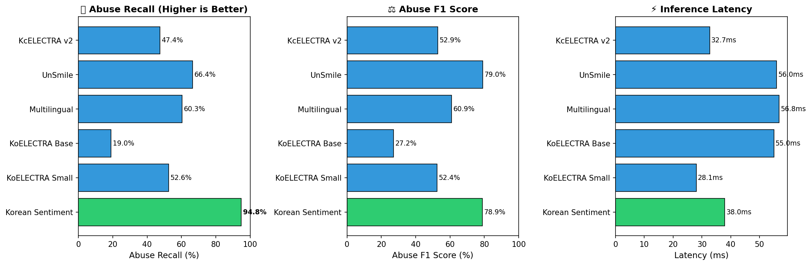
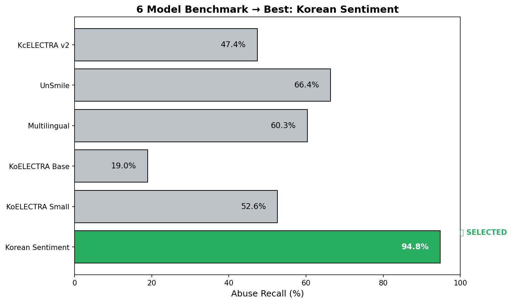

# 🎮 6개 모델 벤치마크 결과

## 📊 테스트 환경
- **테스트 데이터**: `game_test.tsv` (187건)
- **테스트 일시**: 2026-02-08 17:23
- **데이터 출처**: 협동 게임 STT + 유튜브 협동게임 STT

---

## 🏆 결과 요약

| 모델 | Abuse Recall | Abuse Precision | Abuse F1 | FP (오탐) | 선정 |
|------|:------------:|:---------------:|:--------:|:---------:|:----:|
| Korean Sentiment | **94.83%** | 67.48% | 78.85% | 53 ⚠️ | |
| **UnSmile** | 66.38% | **97.47%** | **78.97%** | **2** | ✅ |
| Multilingual | 60.34% | 61.40% | 60.87% | 44 | |
| KoELECTRA Small | 52.59% | 52.14% | 52.36% | 56 | |
| KcELECTRA v2 | 47.41% | 59.78% | 52.88% | 37 | |
| KoELECTRA Base | 18.97% | 47.83% | 27.16% | 24 | |

---

## 🎯 UnSmile 선정 이유

### ❌ Korean Sentiment는 왜 탈락?
- **Recall 94.8%** (1위) 이지만...
- **FP = 53건** → 정상 발언을 욕설로 오판
- 게임에서 **"억울한 저주"** 다수 발생 → 유저 경험 망가짐

### ✅ UnSmile 선정 이유
| 지표 | 값 | 의미 |
|------|:--:|------|
| **Precision** | **97.47%** | 욕설이라고 판단하면 거의 100% 맞음 |
| **F1 Score** | **78.97%** | Precision + Recall 밸런스 최고 |
| **FP (오탐)** | **2건** | 억울한 저주 거의 없음 |

### 📌 핵심 논리
> **게임에서는 "억울한 저주"가 치명적!**
> - Recall이 높아도 오탐이 많으면 유저 불만 폭발
> - **Precision이 높은 모델** = 확실한 욕설만 잡음 = 안전한 선택

---

## 📈 시각화

### 6개 모델 비교

### 베스트 모델 선정

---

## 📋 상세 결과 (Confusion Matrix)

| 모델 | TP | TN | FP | FN | Precision | Recall |
|------|:--:|:--:|:--:|:--:|:---------:|:------:|
| Korean Sentiment | 110 | 18 | 53 | 6 | 67.5% | 94.8% |
| KoELECTRA Small | 61 | 15 | 56 | 55 | 52.1% | 52.6% |
| KoELECTRA Base | 22 | 47 | 24 | 94 | 47.8% | 19.0% |
| Multilingual | 70 | 27 | 44 | 46 | 61.4% | 60.3% |
| **UnSmile** | 77 | 69 | **2** | 39 | **97.5%** | 66.4% |
| KcELECTRA v2 | 55 | 34 | 37 | 61 | 59.8% | 47.4% |

---

## 🚀 다음 단계
1. UnSmile 선정 → **Recall을 높이기 위해 Fine-tuning**
2. 게임 STT 데이터로 LoRA / Full Fine-tuning 비교
3. 최적 모델 INT8 양자화
