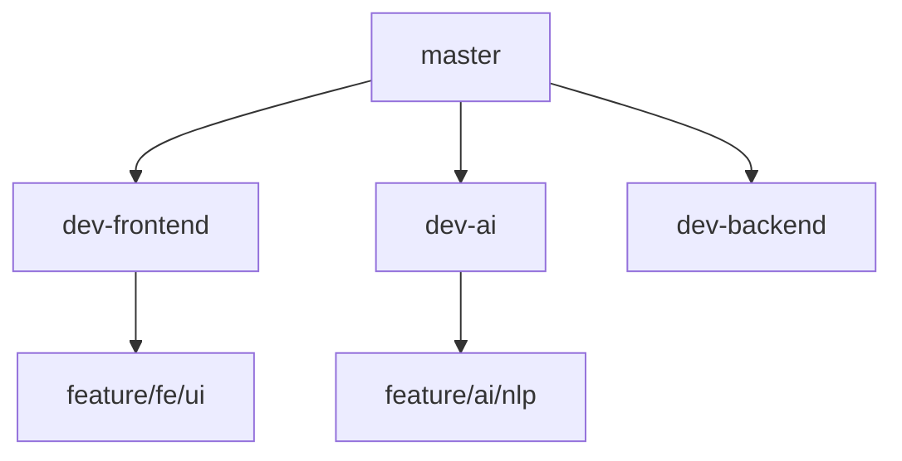
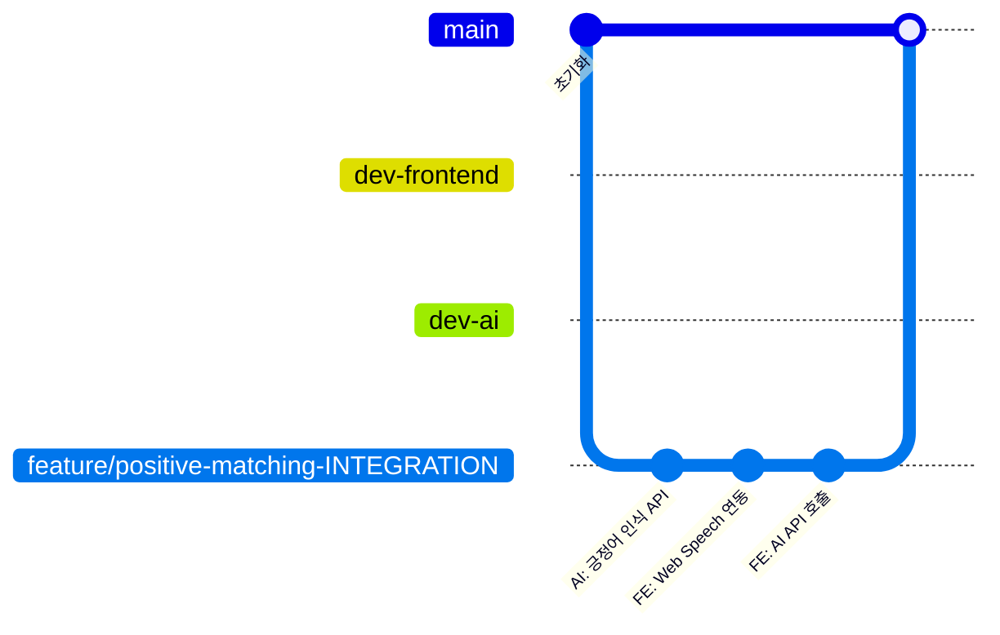

# 🌳 브랜치 및 통합 전략 가이드 (Git Strategy)

우리 프로젝트처럼 하나의 리포지토리 안에 여러 파트(`AI`, `FE`, `BE`)가 공존할 때, "긍정어 매칭"처럼 여러 파트를 한꺼번에 건드려야 하는 기능을 어떻게 관리할지 정리해 드립니다.

## 1. 현재 구조의 문제점 (As-Is)
현재 구조는 각 파트가 자기 방(`dev-fe`, `dev-ai`)에만 갇혀 있어서, 거실(통합 기능)에서 만나기가 힘든 구조입니다.


> **문제**: `feature/fe/ui` 브랜치에서는 `dev-ai`에 추가된 최신 API를 볼 수 없고, 테스트할 수도 없습니다.

---

## 2. 권장 해결책: 기능 중심 통합 (Feature Integration)

여러 파트를 동시에 건드려야 하는 "긍정어 매칭" 같은 기능은 **최상위 브랜치(master)**에서 직접 브랜치를 따서 모든 폴더를 한꺼번에 수정하는 것이 가장 깔끔합니다.

### 🛠️ 작업 순서 (Best Practice)
1.  **기반 다지기**: `master` (또는 전체가 합쳐진 `develop`) 브랜치로 이동합니다.
2.  **통합 브랜치 생성**: `feature/pos-matching-total` 브랜치를 만듭니다.
3.  **동시 작업**: 
    - `echoforest-ai/` 폴더에 긍정어 감지 로직 구현.
    - `echoforest-frontend/` 폴더에 Web Speech API 연동 코드 구현.
4.  **검증**: 한 브랜치 안에서 서버와 클라이언트를 모두 돌려보며 연동 테스트를 합니다.
5.  **병합**: 테스트가 끝나면 이 브랜치를 다시 `master`로 합칩니다.

---

## 3. Git 흐름도 (Proposed)



---

## 4. 백엔드 팀원에게는 뭐라고 하나요?

"우리가 이번에 만드는 긍정어 매칭은 AI랑 프론트가 긴밀하게 연결되어야 해서, **상위 브랜치에서 통합 브랜치를 하나 파서 작업**할 거야. 그래야 내가 짠 AI 코드를 프론트에서 바로 테스트해 볼 수 있거든!"

---

## 5. 협업 시 충돌 방지: "누가 Web Speech를 먼저 건드나?"

사용자님이 걱정하시는 **"Web Speech라는 동일한 기능을 서로 다른 사람이 건드릴 때 생기는 충돌"**은 아주 빈번한 문제입니다. 이를 해결하기 위해 **'방 개별 사용'** 전략을 추천합니다.

### 🛠️ 구조적 해결책 (Structural Solution)
마이크를 켜고 소리를 듣는 **'뼈대'**는 한 명(예: 팀원)이 만들고, 사용자님은 그 텍스트를 받아 **'긍정어인지 판단하는 로직'**만 따로 빼서 작업하는 방식입니다.

1.  **공용 엔진 (Common Engine)**: `SpeechService.js` (마이크 켜기, 소리 듣기 전담)
    - 이 파일은 한 명만 건드립니다.
2.  **개별 처리기 (Handlers)**:
    - `PositiveHandler.js` (사용자님: 긍정어만 체크)
    - `NegativeHandler.js` (팀원: 부정어만 체크)

### 💡 Git 충돌 방지 꿀팁
- **파일 분리**: 서로 다른 파일에서 작업하면 Git은 절대 충돌(Conflict)이 나지 않습니다.
- **먼저 깃발 꽂기**: 한 명이 Web Speech API의 기본 뼈대(마이크 권한 얻기 등)를 먼저 짜서 `dev-frontend`에 올립니다. 나머지 팀원들은 그 코드를 `git pull`로 받아와서, 자기가 맡은 Handler 파일만 새로 만들어 개발합니다.

---

## 6. 마스터가 빈 상태에서 어디로 모이나?

현재 `master`가 비어 있다면 팀원들과 **`develop`** 브랜치를 하나 약속해서 만드세요.

1.  **Base 생성**: `master`에서 `develop` 브랜치를 하나 뽑습니다.
2.  **교점 설정**: 각자 `dev-fe`, `dev-ai`에서 작업하다가, **일주일에 한두 번씩 날짜를 정해 `develop`으로 합칩니다.**
3.  **동기화**: 합쳐진 최신 `develop` 코드를 다시 각자의 `dev-` 브랜치로 `pull` 받아오면, 팀원이 짠 Web Speech 뼈대를 내가 바로 받아서 쓸 수 있습니다.

---

## 7. 추천 폴더/파일 구조 (Plugin Architecture)

프로젝트가 커져도 충돌을 막을 수 있는 **'폴더+파일 분리'** 구조를 추천합니다.

### 📂 구조도
```text
echoforest-frontend/
└── src/
    └── services/
        └── stt/
            ├── STTEngine.js      (공통: 마이크/STT 뼈대)
            └── handlers/          (폴더: 개별 로직 저장소)
                ├── PositiveHandler.js (사용자님: 뽀뽀, 사랑해)
                ├── NegativeHandler.js (팀원: 욕설, 비난)
                └── index.js           (분석기들을 모아주는 역할)
```

### 💡 왜 폴더를 따로 만드나요?
1.  **관심사 분리**: STT 뼈대와 '무슨 단어를 찾을지'를 정하는 로직을 분리하여 코드가 섞이지 않습니다.
2.  **협업 편의**: 사용자님과 팀원이 `handlers/` 폴더 안에 **서로 다른 파일**을 만들기 때문에, 한 브랜치로 합칠 때 Git이 머리를 싸매지 않아도 됩니다.
3.  **확장성**: 나중에 '포즈 인식 핸들러'나 '아이템 사용 핸들러'가 추가되어도 똑같은 방식으로 파일만 늘리면 됩니다.

**결론**: **`stt/` 폴더**와 그 안에 **`handlers/` 폴더**를 모두 만드시는 것을 강력 추천합니다!
