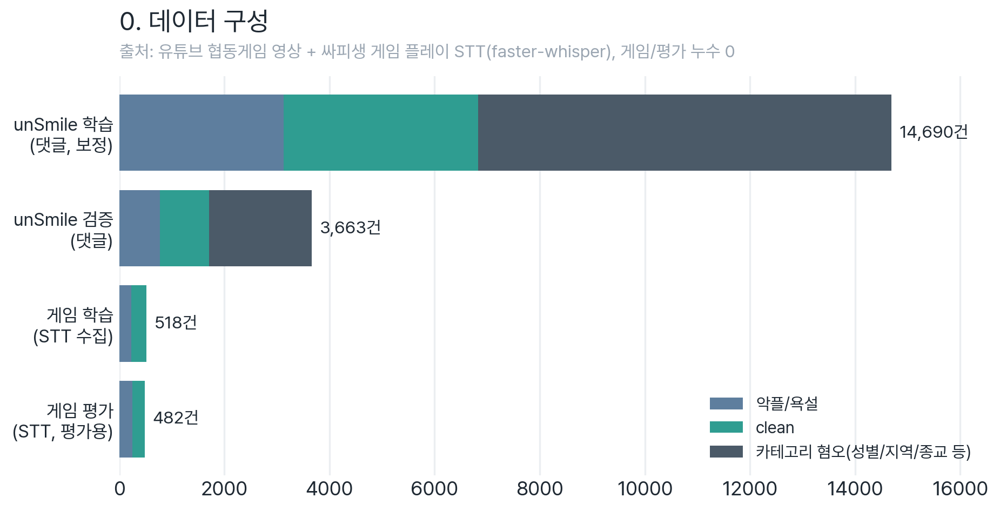

# 0_Data_Collection, 데이터 수집·라벨링

게임 음성채팅(STT)을 모아 정제·라벨링해서 **파인튜닝/평가용 데이터셋**을 만드는 단계입니다.
각 처리 단계가 **자기 폴더에 코드 + 그 단계의 출력 데이터를 함께** 둡니다(`01`→`06`).



## 📁 구조

| 폴더 | 하는 일 | 입력 → 출력 |
| :--- | :--- | :--- |
| `01_download/` | YouTube 오디오 다운로드 (yt-dlp, 403 우회) | `00_url_list.txt` → `audio_N.wav`(로컬)·`audio_N.opus`(LFS) |
| `02_stt/` | faster-whisper large-v3 STT (GPU) | `../01_download` 오디오 → `audio_N.tsv` |
| `03_clean/` | 병합·정제(기호·자모·외국어 노이즈, 중복) | `../02_stt` → `merged_stt_cleaned.tsv` |
| `04_anonymize/` | **개인지칭(닉네임) 토큰만 제거** (행 유지, Kiwi) | `../03_clean` → `final_dataset.tsv` |
| `05_advanced_clean/` | 고급 정제(환각·중복, min 2자) | `../04_anonymize` → `final_dataset_clean.tsv` |
| `06_prelabel/` | **unSmile abuse/clean 사전라벨** | `../05_advanced_clean` → `review_candidates.tsv` |
| `collected_game_chat/` ⭐ | 손수 수집한 게임채팅(메아리의 숲 플레이 STT + YouTube STT)을 clean/negative 분류 | `*.json` → `datasets/train_collected.tsv`(518) |
| `datasets/` ⭐ | **최종 단일 출처**: `train_collected`(518)·`test_set`(482) | 모든 학습·평가가 여기서 읽음 |

> `06`의 사전라벨은 **초안** → 사람이 `검수` 칼럼 확정 → 문장+10라벨만 추출해 학습 데이터에 합침(누수검증 후).

## 🔗 흐름

```
[수집 파이프라인], 각 폴더에 코드+출력 함께
01_download → 02_stt → 03_clean → 04_anonymize → 05_advanced_clean → 06_prelabel
 (오디오)      (STT)     (정제)      (닉네임토큰제거)    (고급정제)          (사전라벨) ─→ 사람검수 ─→ datasets/(학습보강)

[기존 학습/평가 데이터]
collected_game_chat (메아리의숲+YouTube STT, 손수분류) ─→ datasets/train_collected.tsv (518) ─→ 4_LoRA/5_Full 학습
                                                          datasets/test_set.tsv (482, 고정) ─→ 모델선정·비교·양자화 평가
```

> 03~06 산출물은 `source` 칼럼(출신 영상 id, 예: `audio_1`)을 들고 다닌다 → 영상별로 골라 쓰기·검수 추적 가능. 같은 문장이 여러 영상에 나오면 `audio_3;audio_7`처럼 `;`로 합쳐 보존(전역 중복제거).

## 🚀 실행 (conda)

```bash
python 01_download/01_youtube_downloader.py
python 02_stt/02_whisper_transcriber.py
python 03_clean/03_text_clean.py
python 04_anonymize/04_text_anonymize.py
python 05_advanced_clean/05_text_clean_advanced.py
python 06_prelabel/06_prelabel_unsmile.py
```

> conda 환경에서 `PYTHONUTF8=1`(이모지 cp949 크래시 방지), GPU STT는 `HF_HUB_DISABLE_SYMLINKS=1` 권장.
> 의존성: `conda install ffmpeg -c conda-forge` + `pip install yt-dlp faster-whisper torch kiwipiepy pandas transformers`

## 🏷️ 라벨 정책, abuse/clean 이진

unSmile **10라벨 포맷은 유지**하되(공식·train_collected 호환), 우리 데이터는 **abuse vs clean 이진**으로 모은다.

**판정 규칙**: unSmile의 **9개 부정 라벨**(여성/가족·남성·성소수자·인종/국적·연령·지역·종교·기타 혐오·악플/욕설) **중 하나라도** 임계값(0.3)을 넘으면 **abuse**, 하나도 안 뜨고 `clean`만이면 **평문(clean)**.
- 즉 `clean`이 아닌 어떤 부정 라벨(예: 지역·종교 혐오)이 떠도 **모두 abuse로 잡는다**, "악플/욕설"만 보는 게 아님.
- 다만 **저장**은 9개를 굳이 구분하지 않고 `악플/욕설=1`(abuse) / `clean=1`(평문) 한 쌍으로 이진화한다. 게임 채팅 부정 발언은 대부분 `악플/욕설`이고, 기획서 목표도 "악플/욕설 Recall 개선"이라 세부 '대상' 카테고리는 따로 보존하지 않는다.
- 이 0.3은 `06_prelabel`의 **사전라벨 후보 넓게 잡기용**입니다. 모델 선정·비교·압축 평가는 모두 **not-clean**(clean 제외 9개 라벨 max) 기준이며, 비교 임계값은 **0.5**로 통일합니다. 운영 임계값은 별도 보정 대상이지만, 현재 권장 압축 산출물인 FP16은 0.5 기준 성능을 그대로 보존합니다.

(코드 상세: `06_prelabel_unsmile.py` docstring)

## 🗂️ git 정책

- 원본 `*.wav`: 로컬만(용량). 압축본 `*.opus`: **LFS로 커밋**(원본 영상 삭제 대비 아카이브).
- STT·정제 tsv: 작은 텍스트라 커밋(전사본 보존).

## ℹ️ 참고

- 예전 **8라벨 자체 분류 시도**는 미채택이라 제거하고 10라벨 unSmile로 선회(서사는 velog).
- 공식 unSmile 원본은 최상위 [`UnSmile/`](../UnSmile), 보정은 [`3_UnSmile_Correction`](../3_UnSmile_Correction).
- 파이프라인 설계 의사결정: [`수집_파이프라인_설계노트.md`](수집_파이프라인_설계노트.md).
