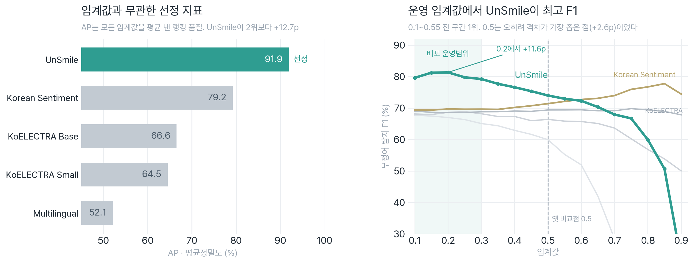

# 1_Model_Selection, STT·욕설탐지 모델 선정

게임 음성채팅 파이프라인의 **두 모델**을 고르는 단계입니다.
1. **STT 엔진** (음성→텍스트, 런타임): `00_STT_Engine_Selection/`
2. **욕설/혐오 탐지 모델** (텍스트→abuse/clean): 이 폴더 루트의 벤치마크

## 📂 구조

| 경로 | 내용 |
| :--- | :--- |
| `00_STT_Engine_Selection/` | 런타임 STT 엔진 선정(Web Speech API), 근거 `STT_COMPARISON.md` + 실측 `web_speech_api/` |
| `benchmark_game_stt.py` | 5개 욕설탐지 모델을 `test_set.tsv`(482)로 추론·평가 → `results/` 갱신 |
| `plot_benchmark.py` | 결과 CSV로 **포트폴리오용 차트**(영어/한국어) 렌더, 추론과 분리(재추론 불필요) |
| `benchmark_game_stt.ipynb` | 노트북 버전(참고) |
| `results/` | 산출물: `MODEL_BENCHMARK.md`(상세+그래프 설명)·`benchmark_results.csv`·그래프(en/ko) |
| `MODEL_SELECTION.md` | 선정 근거 메모(기준·트러블슈팅 교훈) |

## 🏆 선정 결과, UnSmile

`test_set.tsv`(482, 학습에 안 쓴 평가셋) 5종 비교. **선정 기준은 임계값과 무관한 AP(평균정밀도)**, UnSmile 91.9%로 2위(+12.7%p) 압도. F1@0.5는 참고 운영점. (상세 → [`results/MODEL_BENCHMARK.md`](./results/MODEL_BENCHMARK.md))



| 모델 | **AP**(임계값 무관) | F1@0.5 | Recall | Precision | 유형 |
| :--- | :---: | :---: | :---: | :---: | :--- |
| **UnSmile** (`smilegate-ai/kor_unsmile`) | **91.9** | 74.0% | 60.1% | **96.1%** | ✅ 선정 (한국어 혐오 전용) |
| Korean Sentiment | 79.2 | 71.4% | 94.0% | 57.5% | 범용 감정(과탐) |
| KoELECTRA Base | 66.6 | 69.3% | 90.3% | 56.3% | 범용 감정(과탐) |
| KoELECTRA Small | 64.5 | 66.3% | 84.3% | 54.7% | 범용 감정(과탐) |
| Multilingual | 52.1 | 60.0% | 70.2% | 52.4% | 범용 감정(과탐) |

> **선정 기준은 Recall이 아니라 임계값과 무관한 AP.** 감정모델 4종은 Recall(70~94%)은 높아도 부정 감정을 다 부정어로 오탐 → **Precision 52~58%**(clean 234건 중 158~174건 오탐) → 게임에 쓰면 멀쩡한 말에 저주 발동. UnSmile만 오탐 **6건**(Precision 96.1%)이라 **AP 91.9%로 압도적 1위(F1도 1위)**. 0.5 한 점이 아니라 모든 임계값을 평균해 골랐다.
> (UnSmile은 배포 규칙 not-clean(clean이 아니면 부정어, 9개 라벨 max > 0.5) 기준. 나머지 4종은 각자의 abuse 출력 기준이라 정밀도/재현율 경향 위주로 비교)
>
> ※ `beomi/KcELECTRA-base-v2022`는 분류 헤드가 없는 base LM이라 후보 제외(4·5단계에서 게임 데이터로 헤드 학습). KoELECTRA 2종은 저장 헤드가 구 형식이라 **수동 로드**해 실수치 산출.

> 🎯 **이 선정은 "완성"이 아니라 "파인튜닝의 출발점".** UnSmile도 게임 채팅에선 **Recall 60%(부정어의 40%를 놓침)** 가 한계, 임계값을 낮춰 더 잡으려 하면 멀쩡한 게임 오더(`가만히 있어라 좀`)까지 과탐하는 *threshold 딜레마*에 빠진다. 이 한계를 **게임 데이터 fine-tuning(3~7단계)** 으로 푼다(Recall↑ · Precision 유지). → [`../AI_파이프라인_개요.md`](../AI_파이프라인_개요.md)

## 🚀 실행

```bash
cd 1_Model_Selection
python benchmark_game_stt.py   # test_set.tsv(482) 추론·평가 → results/ (CSV·MD·그래프 en/ko)
python plot_benchmark.py       # (선택) 차트만 다시 그리기, 재추론 없이 CSV로 렌더
```

## 📖 관련 문서

- 선정 상세 + **그래프 읽는 법**: [`results/MODEL_BENCHMARK.md`](./results/MODEL_BENCHMARK.md)
- 선정 근거·트러블슈팅 교훈: [`MODEL_SELECTION.md`](./MODEL_SELECTION.md)
- STT 엔진 결정: [`00_STT_Engine_Selection/STT_COMPARISON.md`](./00_STT_Engine_Selection/STT_COMPARISON.md)
- 프로젝트 개요·데이터: [`../AI_파이프라인_개요.md`](../AI_파이프라인_개요.md) · [`../0_Data_Collection/`](../0_Data_Collection/)
- 선정한 UnSmile 파인튜닝: [`../4_LoRA_Fine_Tuning/`](../4_LoRA_Fine_Tuning/) · [`../5_Full_Fine_Tuning/`](../5_Full_Fine_Tuning/)
