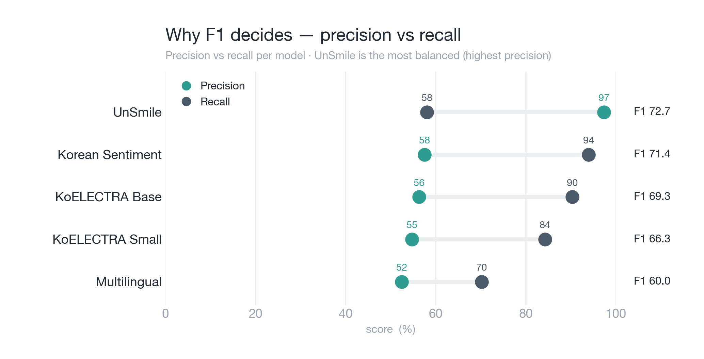

# 🎮 5개 모델 벤치마크 결과

## 📊 테스트 환경
- **테스트 데이터**: `test_set.tsv` (482건, held-out · abuse 248 / clean 234)
- **테스트 일시**: 2026-06-06
- **데이터 출처**: 협동 게임 STT + 유튜브 협동게임 STT
- **모델 수**: 5개 (모두 분류 헤드가 실제로 로드되는 모델만) · **선정 기준**: Abuse F1 · **임계값**: 0.5
- **abuse 판정 = `악플/욕설`(index 8) > 0.5** — 실제 배포(FastAPI `probs[8]`)·Step 2 baseline·Step 6과 **동일 정의**.
- ℹ️ `beomi/KcELECTRA-base-v2022`는 **분류 헤드가 없는 base LM**(ElectraForPreTraining)이라 선정 후보에서 **제외**(4·5단계에서 게임 데이터로 헤드 학습).
- ℹ️ KoELECTRA 2종은 저장 헤드가 구 형식(단일 Linear)이라 표준 로더가 못 읽음 → **인코더+단일 Linear 수동 로드**해 실수치 산출(근거: [`../MODEL_SELECTION.md`](../MODEL_SELECTION.md)).

---

## 🏆 결과 요약 (Abuse F1 순)

| 모델 | Abuse Recall | **Abuse F1** | Precision | 유형 |
|------|:---:|:---:|:---:|:---|
| **UnSmile** ✅ | 58.06% | **72.73%** | **97.30%** | 한국어 혐오발언 전용 |
| Korean Sentiment | 93.95% | 71.36% | 57.53% | 범용 감정(긍/부정) |
| KoELECTRA Base | 90.32% | 69.35% | 56.28% | 범용 감정 |
| KoELECTRA Small | 84.27% | 66.35% | 54.71% | 범용 감정 |
| Multilingual | 70.16% | 60.00% | 52.41% | 범용 감정(별점) |

> **한 줄**: 감정모델 4종은 Recall은 높아도 **Precision이 52~58%(과탐)**, UnSmile만 **Precision 97%**라 F1 1위.

> 🎯 **Step 1의 결론은 "UnSmile 선정"이지 "완성"이 아니다.** UnSmile은 **파인튜닝의 가장 좋은 출발점** — 게임 채팅에서 **Recall 58.06%(욕설 248건 중 104건을 놓침)** 가 한계다. 임계값을 낮춰 더 잡으려 하면 멀쩡한 게임 오더(`가만히 있어라 좀`)까지 과탐하는 *threshold 딜레마*에 빠진다. → 이 한계를 **게임 데이터 fine-tuning(3~7단계)** 으로 푼다(Recall↑ & Precision 유지). 배경: [`../../AI_파이프라인_개요.md`](../../AI_파이프라인_개요.md)

---

## 🔁 구 688판 대비 (재정제 전후, UnSmile · 둘 다 index-8)

| 지표 | 구 test_set (688) | 현 test_set (482) | 변화 |
|------|:---:|:---:|:---:|
| Abuse Recall | 63.72% | 58.06% | -5.7%p |
| Abuse F1 | 73.26% | **72.73%** | -0.5%p |

> 482는 더 어렵고(긴 완결문장) 균형 잡힌(abuse 51%, 688은 31%) 셋이라 Recall은 다소 내려갔지만 **F1은 거의 동일**. **선정 결론(UnSmile 1위)은 그대로 유지**. (구 결과 백업: [`_archive/`](./_archive/))

---

## 🎯 UnSmile 선정 이유

### 1. 최고 성능 (선정 기준: Abuse F1)
- **Abuse F1**: 72.73% (모델 중 1위)
- **Abuse Precision**: 97.30% · **Recall**: 58.06%
- **Accuracy**: 77.59% · **Clean F1**: 80.99%

> ⚠️ 선정은 Recall이 아니라 **F1 기준**. 단순 Recall 최대 모델은 거의 모든 문장을 욕설로 분류해(Precision↓·오탐↑) 실사용 불가 → 균형 지표로 선정.

### 2. 한국어 혐오 발언 전용
- Smilegate AI의 **한국어 혐오 발언 탐지** 전용 모델, 댓글/채팅 학습 → 게임 대화에 적합.
- 나머지 4종은 모두 **범용 감정모델**(긍정/부정) — "부정 감정"을 "욕설"로 간주하다 보니 과탐.

### 3. 다른 모델 한계 — 감정 ≠ 욕설
- **감정모델 4종 공통**: "아 졌다", "망했어" 같은 **부정 감정이지만 멀쩡한 말**까지 욕설로 오탐 → Precision 52~58%. clean 234건 중 **158~174건**을 욕설로 잘못 판정.
- 그래서 Recall(70~94%)은 높아도 게임에 쓰면 **멀쩡한 말에 저주 발동** → 실사용 불가.

> 💡 **핵심 대비**: UnSmile은 clean 234건 중 오탐이 **단 4건**(Precision 97.3%). 감정모델들은 **158~174건** 오탐. Recall만 보면 Korean Sentiment(94%)가 높지만, F1로 보면 UnSmile이 1위 — 그래서 **F1 기준 선정**.

---

## 📈 그래프 자세히 보기

> 영어판 + 한국어판(`_ko`) 제공. 생성: `python plot_benchmark.py` (CSV 기반, 재추론 불필요).
> 두 그래프는 **한 쌍**으로 읽는다 — ①은 *"누가 1등인가"*, ②는 *"왜 그 기준(F1)으로 뽑았나"*.

### ① 선정 — Abuse F1 랭킹

한국어판: [`best_model_selection_ko.png`](./best_model_selection_ko.png)

**무엇을 보여주나**: 5개 모델을 **Abuse F1**(욕설 탐지의 Precision·Recall 조화평균)으로 줄세운 가로 막대. 위로 갈수록 높음.

**읽는 법 (요소별)**
- **x축** = Abuse F1 (%), 0~100. 막대 끝 숫자 = F1 값.
- 🟩 **틸(녹색) 막대 + `선정` 알약** = 선정된 **UnSmile**(72.7).
- ◾ **회색 막대** = 나머지 4종(Korean Sentiment 71.4 · KoELECTRA Base 69.3 · KoELECTRA Small 66.3 · Multilingual 60.0) — 전부 범용 감정모델.

**읽어내는 것**: UnSmile이 1위. 단, F1만 보면 격차가 작아 보인다(72.7 vs 71~60). **격차의 본질(왜 UnSmile이 실사용 가능한가)은 ②에서** Precision으로 드러난다.

> **결론**: F1 1위 = **UnSmile 선정**.

### ② 왜 F1으로 뽑았나 — Precision vs Recall (덤벨)

한국어판: [`6_model_comparison_ko.png`](./6_model_comparison_ko.png)

**무엇을 보여주나**: 5개 모델 각각의 **Precision(정밀도)** 과 **Recall(재현율)** 을 한 행에 두 점으로 찍고 선으로 이은 *덤벨* 차트.

**먼저 용어**
- **Precision(정밀도)** = *"욕설이라 판정한 것 중 진짜 욕설 비율"* → 높을수록 **오탐(FP)이 적다**(= 멀쩡한 말을 욕설로 안 잡음).
- **Recall(재현율)** = *"실제 욕설 중 잡아낸 비율"* → 높을수록 **놓침(FN)이 적다**.

**읽는 법 (요소별)**
- 🟢 **녹색 점** = Precision · ⬤ **슬레이트 점** = Recall · 두 점을 잇는 **선 = 둘의 간격(불균형)**.
- 오른쪽 **`F1 xx.x`** = 그 모델의 F1(두 지표의 균형).

**핵심 패턴**: **녹색 점(Precision)만 보라.**
- **감정모델 4종**(Korean Sentiment·KoELECTRA Base/Small·Multilingual)은 녹색 점이 전부 **52~58에 수직으로 몰려 있다** = 다 같이 과탐. Recall(슬레이트)은 70~94로 제각각이지만 Precision은 똑같이 낮다.
- **UnSmile**만 녹색 점이 **97(우측 끝)** 으로 홀로 튀어나와 있다 = 오탐이 거의 없다.

**왜 이 그래프가 결정적인가**: Recall(슬레이트)만 보면 Korean Sentiment(94)·KoELECTRA Base(90)가 UnSmile(58)보다 좋아 보인다. 하지만 **녹색 점의 위치**를 보면 감정모델은 전부 왼쪽(과탐), UnSmile만 오른쪽(정밀)이다. 게임에선 *오탐 = 욕 안 했는데 저주 발동*이라 Precision이 중요 → **두 지표를 함께 보는 F1으로 골라야** 하고, F1은 UnSmile이 1위. 이 한 장이 "①의 선정 기준이 왜 F1인지"를 증명한다.

---

## 📋 상세 결과 (Confusion Matrix)

| 모델 | TP | TN | FP | FN | Precision | Recall |
|------|:--:|:--:|:--:|:--:|:---------:|:------:|
| UnSmile | 144 | 230 | **4** | 104 | **97.3%** | 58.1% |
| Korean Sentiment | 233 | 62 | 172 | 15 | 57.5% | 94.0% |
| KoELECTRA Base | 224 | 60 | 174 | 24 | 56.3% | 90.3% |
| KoELECTRA Small | 209 | 61 | 173 | 39 | 54.7% | 84.3% |
| Multilingual | 174 | 76 | 158 | 74 | 52.4% | 70.2% |

> **FP(오탐) 칼럼이 핵심**: UnSmile 4건 vs 감정모델 158~174건. clean 234건 기준이다.

---

## 🚀 다음 단계 — Step 1은 "베이스 선정", 이제 fine-tuning
선정한 UnSmile의 게임 채팅 **Recall 58%를 끌어올리는 것**이 목표(Precision은 유지):
1. UnSmile 기반으로 **게임 STT 데이터로 Fine-tuning** (LoRA/Full)
2. 8개 파인튜닝 모델 + baseline 비교 → 최적 모델 선정
3. 최적 모델 압축/배포 평가(FP16 우선, INT8 보정 검토)
