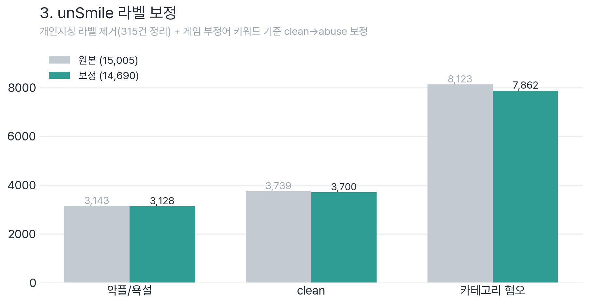

# 3_UnSmile_Correction, 공식 unSmile 라벨 보정

공식 unSmile 학습 데이터의 **라벨 오류를 게임 도메인 기준으로 보정**하는 단계입니다.



> 📖 **왜 보정하나(threshold 딜레마)** → [AI 파이프라인 개요](../AI_파이프라인_개요.md) · **수치 종합** → [기획서](<../Setting/AI 모델 고도화 기획서.md>)

## ⭐ 한 줄 요약

- **입력**: `UnSmile/UnSmile_Dataset_Drop_개인지칭/`, 개인지칭 행·칼럼이 **이미 제거된** 공식 데이터셋
- **이 폴더가 한 일**: 문장·행은 그대로 두고 **라벨만** `clean → 악플/욕설`로 보정 (**train 39건 / valid 5건**)
- **안 한 것**: 행 삭제 ❌, 자모(`ㅋㅋ`)·짧은 문장 제거 ❌

## 🎯 왜 보정하나

base unSmile은 게임 특유 부정어(`빡치다`·`트롤`·`못하네`·`정신차려`)를 **`clean`으로 오분류** → 악플/욕설 Recall이 낮음. threshold만으론 "게임 부정어 잡기 + 멀쩡한 말 놔두기"를 동시에 못 하므로, **학습 데이터의 라벨 자체를 고쳐** 학습으로 풀게 한다. (상세 동기: [개요](../AI_파이프라인_개요.md))

## 🔁 2단계 흐름 (개인지칭 제거 ≠ 이 폴더)

```
공식 원본 (UnSmile/UnSmile_Dataset)            train 15,005 / valid 3,737 · 12칼럼(개인지칭 포함)
   │  ① [사전 단계, 이 폴더 밖] 개인지칭 행·칼럼 제거
   ▼
UnSmile/UnSmile_Dataset_Drop_개인지칭           train 14,690 / valid 3,663 · 11칼럼   ← 이 폴더의 입력
   │  ② [3_UnSmile_Correction] 게임 부정어 키워드 재라벨 (clean→abuse)
   ▼
unsmile_train/valid_corrected.tsv               train 14,690 / valid 3,663 · 라벨만 변경
```

### ① 개인지칭 제거, 사전 단계(이 폴더 밖)

- 개인지칭(닉네임 지칭) 라벨은 **abuse/clean 이진 과제와 무관**해 행·칼럼째 제거 (라벨 정책: [`0_Data_Collection`](../0_Data_Collection/README.md))
- train **15,005 → 14,690** (−315), valid **3,737 → 3,663** (−74), 삭제분은 **전부 `개인지칭==1`** (원본 개인지칭 개수와 정확히 일치, 검증됨)
- `개인지칭` 칼럼 자체도 삭제 (12칼럼 → 11칼럼)
- ⚠️ 이 변환의 생성 스크립트는 레포에 남아있지 않음, 산출물 `UnSmile_Dataset_Drop_개인지칭`을 원본과 비교해 "개인지칭 행·칼럼 제거"임을 **코드로 검증**함

### ② 라벨 보정, 이 폴더의 작업

`clean=1`이지만 게임 부정어를 포함한 문장을 `악플/욕설=1, clean=0`으로 정정.

**키워드 목록** (Baseline False Negative 분석 기반)

```
빡치 · 빡친 · 빡쳐 · 열받 · 킹받 · 답답 · 지랄 · 아가리 · 트롤 · 던지
억까 · 똑바로 · 제대로 · 정신차려 · 정신안차려 · 니 때문 · 너 때문 · 못하네 · 못해
```

**보정 수치** (Drop_개인지칭 → 보정본)

| | 행수 | clean | 악플/욕설 | 재라벨 |
|------|:----:|:-----:|:--------:|:------:|
| **train** | 14,690 | 3,739 → **3,700** | 3,089 → **3,128** | **39** (clean→abuse) |
| **valid** | 3,663 | 935 → **930** | 772 → **777** | **5** (clean→abuse) |

> 검증: 보정본은 Drop_개인지칭과 **문장 집합·행 순서가 완전히 동일**하고 위 라벨만 바뀜. (train 14,690행 = 고유문장 14,689 + 중복 1)

### 오탐 복구 (false positive revert)

키워드엔 걸렸지만 **실제로는 clean**인 문장은 abuse로 올리지 않고 clean 유지:

- 찬송가 `주 예수보다 더 귀한것은 없네…`, 칭찬 `제대로 된 ai구나`, 인용 `워렌버핏 말… 챙기지 못해`, 자기고백 `소주+삼겹살 포기못해`, 양보 `퀴어로 사는 것까지 말리진 못해도…`
- train 9건 + valid 3건, 최종 보정본에서 **clean으로 유지됨**(직접 확인). 코드: [`util/revert_false_positives.py`](util/revert_false_positives.py)

## ❓ 안 한 것 (자주 묻는)

- **행 삭제**: 개인지칭(사전 단계) 외에는 없음
- **자모만 문장**(`ㅋㅋ`·`ㅇㅇ` 류): 원본 train 14개 → 보정본 14개, valid 3 → 3, **그대로 보존**
- 자모·짧은 노이즈 제거는 unSmile 보정이 아니라 **게임 STT 수집 파이프라인**([`0_Data_Collection`](../0_Data_Collection) 03·05 정제) 쪽 작업

## 📁 파일

| 경로 | 내용 |
|------|------|
| `correct_code/correct_train.py` · `correct_valid.py` | 키워드 기반 clean→abuse 재라벨 |
| `util/revert_false_positives.py` | 오탐 문장 clean 복구 |
| `util/verify_correction.py` | 원본 대비 보정 결과 검증 |
| `correction_log/correction_log_train.csv` · `_valid.csv` | 보정된 문장 로그 |
| `unsmile_train_corrected.tsv` · `unsmile_valid_corrected.tsv` | **산출물** (보정본) |

## 📤 산출물 사용처

`4_LoRA_Fine_Tuning` · `5_Full_Fine_Tuning` 학습의 기반 데이터:
- **v1** = 이 보정본만
- **v2** = 이 보정본 + 게임 수집 `train_collected`(518) ([`0_Data_Collection/datasets`](../0_Data_Collection/datasets))

## 🚀 실행

```bash
python 3_UnSmile_Correction/correct_code/correct_train.py
python 3_UnSmile_Correction/correct_code/correct_valid.py
python 3_UnSmile_Correction/util/revert_false_positives.py   # 오탐 복구
python 3_UnSmile_Correction/util/verify_correction.py        # 검증
```
