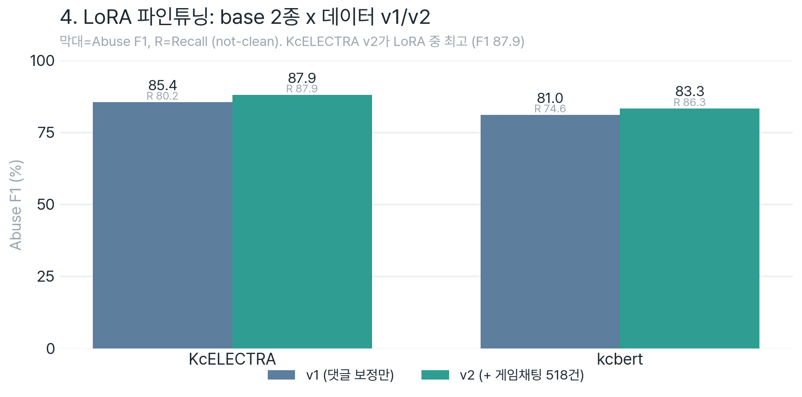
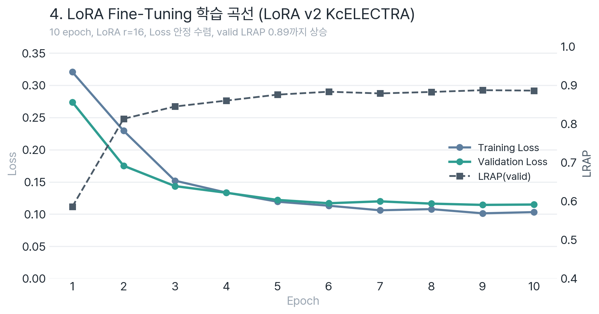

# 4_LoRA_Fine_Tuning

LoRA (Low-Rank Adaptation) 기반 Parameter-Efficient Fine-Tuning





> 첫 그래프는 `test_set.tsv` 기준 4개 LoRA 모델 비교이고, 두 번째 그래프는 LoRA v2 KcELECTRA의 validation 학습 로그입니다.

> 📖 **파인튜닝 동기(threshold 딜레마)·전체 파이프라인 흐름** → [AI 파이프라인 개요](../AI_파이프라인_개요.md)

## 📁 디렉토리 구조

```
4_LoRA_Fine_Tuning/
├── v1_corrected_only/           # 보정 데이터만 (14,690건)
│   ├── lora_game_kcelectra.py/.ipynb
│   ├── lora_tutorial_bert.py
│   ├── lora_tutorial_kcbert.ipynb
│   └── output/                  # 학습 결과 저장
│       ├── lora_game_kcelectra/
│       └── lora_tutorial_kcbert/
│
└── v2_corrected_plus_collected/ # 보정+수집 (15,208건)
    ├── lora_game_kcelectra_v2.py/.ipynb
    ├── lora_tutorial_kcbert_v2.py/.ipynb
    └── output/
        ├── lora_game_kcelectra_v2/
        └── lora_tutorial_kcbert_v2/
```

## 📊 버전별 데이터

| 버전 | 데이터 | 건수 |
|------|--------|------|
| v1 | UnSmile 보정 | 14,690건 |
| v2 | UnSmile 보정 + 게임 음성채팅 수집 | 15,208건 |

## 🔧 LoRA 설정

```python
LORA_R = 16
LORA_ALPHA = 32
LORA_DROPOUT = 0.1
target_modules = ["query", "key", "value"]
```

## 📈 모델 비교

| 실험 | 모델 | 메트릭 |
|--------|------|--------|
| `lora_game_kcelectra` | KcELECTRA-base-v2022 | abuse_recall |
| `lora_tutorial_kcbert` | kcbert-base | LRAP |

> v1 kcbert 실험은 로컬 실행 스크립트명이 `lora_tutorial_bert.py`, 노트북명이 `lora_tutorial_kcbert.ipynb`입니다. 산출물 폴더명은 `lora_tutorial_kcbert/`로 통일되어 Step 6 비교 코드와 연결됩니다.

## 🚀 실행 방법

```bash
# Jupyter 환경
# GPU 서버에 ipynb 파일 업로드 후 실행

# 로컬 conda 환경
conda activate echoforest_ft
python v1_corrected_only/lora_game_kcelectra.py
```
