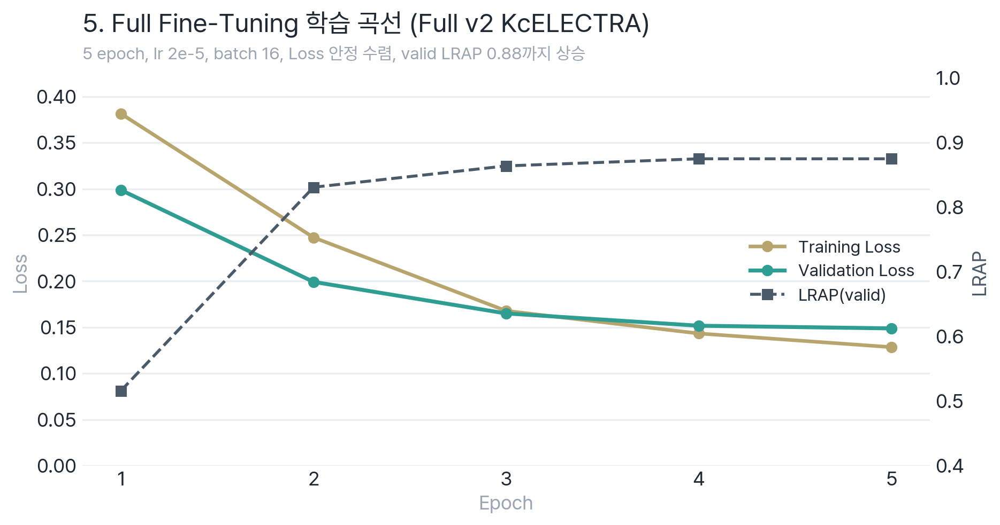

# 5_Full_Fine_Tuning

Full Fine-tuning 기반 모든 파라미터 학습



> 📖 **파인튜닝 동기(threshold 딜레마)·전체 파이프라인 흐름** → [AI 파이프라인 개요](../AI_파이프라인_개요.md)

## 📁 디렉토리 구조

```
5_Full_Fine_Tuning/
├── v1_corrected_only/           # 보정 데이터만 (14,690건)
│   ├── full_game_kcelectra.py/.ipynb
│   ├── full_tutorial_bert.py
│   ├── full_tutorial_kcbert.ipynb
│   └── output/                  # 학습 결과 저장
│       ├── full_game_kcelectra/
│       └── full_tutorial_kcbert/
│
└── v2_corrected_plus_collected/ # 보정+수집 (15,208건)
    ├── full_game_kcelectra_v2.py/.ipynb
    ├── full_tutorial_kcbert_v2.py/.ipynb
    └── output/
        ├── full_game_kcelectra_v2/
        └── full_tutorial_kcbert_v2/
```

## 📊 버전별 데이터

| 버전 | 데이터 | 건수 |
|------|--------|------|
| v1 | UnSmile 보정 | 14,690건 |
| v2 | UnSmile 보정 + 게임 음성채팅 수집 | 15,208건 |

## 🔧 학습 설정

```python
EPOCHS = 5
LEARNING_RATE = 2e-5  # Full FT는 LoRA보다 낮은 LR
BATCH_SIZE = 16       # 메모리 절약
gradient_accumulation_steps = 2
```

## 📈 모델 비교

| 실험 | 모델 | 메트릭 |
|--------|------|--------|
| `full_game_kcelectra` | KcELECTRA-base-v2022 | abuse_recall |
| `full_tutorial_kcbert` | kcbert-base | LRAP |

> v1 kcbert 실험은 로컬 실행 스크립트명이 `full_tutorial_bert.py`, 노트북명이 `full_tutorial_kcbert.ipynb`입니다. 산출물 폴더명은 `full_tutorial_kcbert/`로 통일되어 Step 6 비교 코드와 연결됩니다.

## ⚠️ 참고
Full Fine-tuning은 LoRA보다 학습 시간이 길고 메모리 사용량이 높습니다.

## 🚀 실행 방법

```bash
# Jupyter 환경
# GPU 서버에 ipynb 파일 업로드 후 실행

# 로컬 conda 환경
conda activate echoforest_ft
python v1_corrected_only/full_game_kcelectra.py
```
