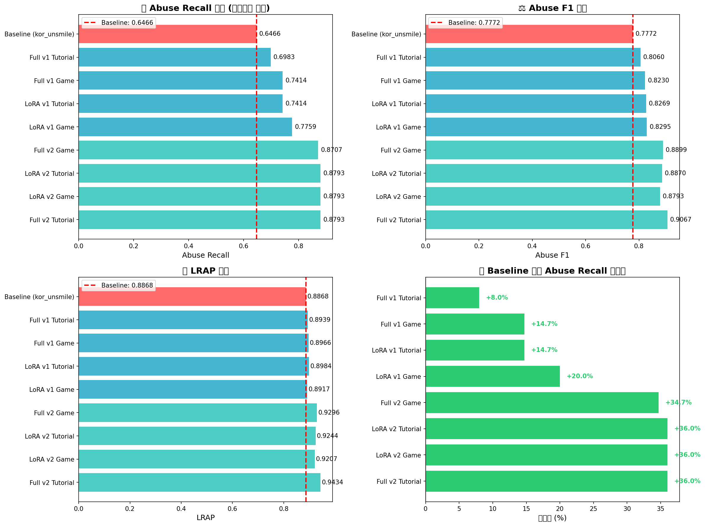
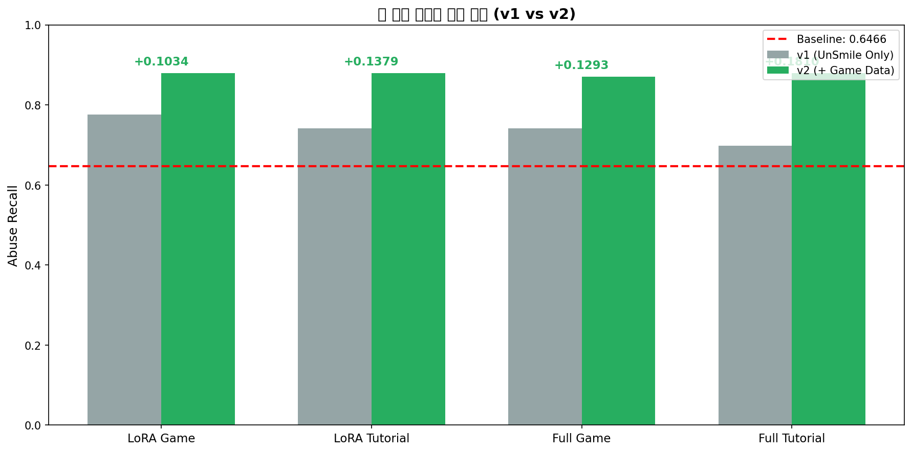
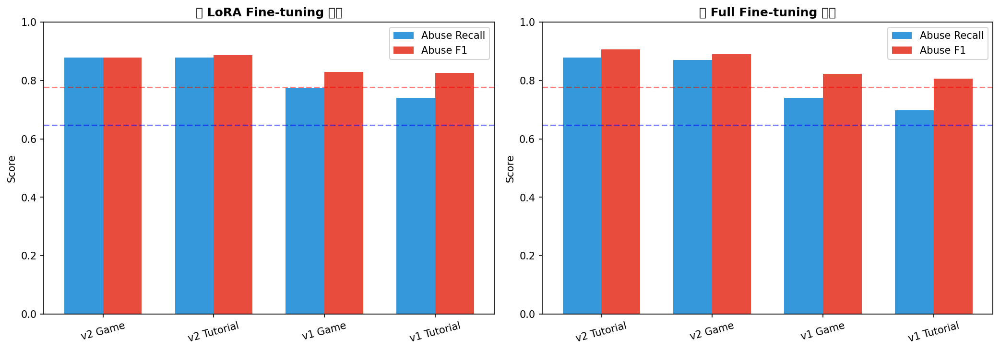
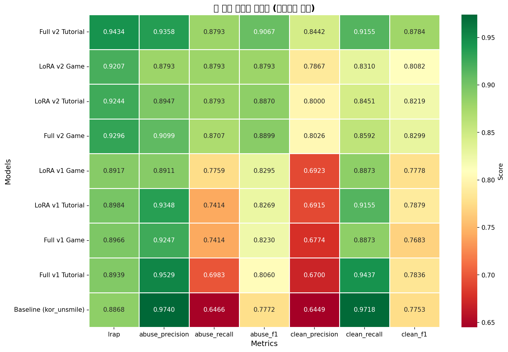

# 5. 모델 비교 (Model Comparison)

Fine-tuning 전/후 모델 성능을 비교하고, 최적 모델을 선정합니다.

---

## 📊 테스트 결과 요약

### 🏆 최종 순위 (Abuse Recall 기준)

| 순위 | 모델 | Abuse Recall | Abuse F1 | LRAP | Baseline 대비 |
|:---:|------|:---:|:---:|:---:|:---:|
| **1** | **Full v2 Tutorial** | **0.8793** | **0.9067** | **0.9434** | **+36.0%** |
| **1** | **LoRA v2 Game** | **0.8793** | 0.8793 | 0.9207 | **+36.0%** |
| **1** | **LoRA v2 Tutorial** | **0.8793** | 0.8870 | 0.9244 | **+36.0%** |
| 4 | Full v2 Game | 0.8707 | 0.8899 | 0.9296 | +34.7% |
| 5 | LoRA v1 Game | 0.7759 | 0.8295 | 0.8917 | +20.0% |
| 6 | LoRA v1 Tutorial | 0.7414 | 0.8269 | 0.8984 | +14.7% |
| 6 | Full v1 Game | 0.7414 | 0.8230 | 0.8966 | +14.7% |
| 8 | Full v1 Tutorial | 0.6983 | 0.8060 | 0.8939 | +8.0% |
| 9 | **Baseline (kor_unsmile)** | 0.6466 | 0.7772 | 0.8868 | - |

> **결론**: 모든 Fine-tuned 모델이 Baseline보다 우수하며, **v2 모델들이 최대 +36% 개선** 달성

---

## 📈 상세 분석

### 1. Baseline vs Fine-tuned (Before/After)



| 비교 항목 | Baseline | Best (Full v2 Tutorial) | 개선 |
|----------|:--------:|:-----------------------:|:----:|
| **Abuse Recall** | 0.6466 | 0.8793 | **+23.27%p (+36%)** |
| **Abuse F1** | 0.7772 | 0.9067 | **+12.95%p** |
| **LRAP** | 0.8868 | 0.9434 | **+5.66%p** |
| **Clean F1** | 0.7753 | 0.8784 | **+10.31%p** |

**핵심 인사이트**:
- Baseline의 Abuse Recall이 **64.66%로 낮음** → 욕설 탐지 누락 多
- Fine-tuning으로 Recall을 **87.93%까지 개선** → 누락 대폭 감소
- Precision도 유지하여 F1 점수 상승

---

### 2. v1 vs v2 (게임 데이터 추가 효과)



| 비교 | v1 (UnSmile Only) | v2 (+ Game Data) | 개선 |
|------|:-----------------:|:----------------:|:----:|
| **LoRA Game** | 0.7759 | **0.8793** | **+10.34%p** |
| **LoRA Tutorial** | 0.7414 | **0.8793** | **+13.79%p** |
| **Full Game** | 0.7414 | **0.8707** | **+12.93%p** |
| **Full Tutorial** | 0.6983 | **0.8793** | **+18.10%p** |

**핵심 인사이트**:
- **v2 (게임 데이터 추가)가 v1 대비 +10~18%p 향상**
- 게임 도메인 데이터가 성능 개선에 **결정적 역할**
- 518건의 게임 데이터만으로도 큰 효과

---

### 3. LoRA vs Full Fine-tuning



| 방법론 | v1 평균 Recall | v2 평균 Recall | 학습 시간 | GPU 메모리 |
|--------|:-------------:|:-------------:|:---------:|:---------:|
| **LoRA** | 0.7587 | **0.8793** | 빠름 | 낮음 |
| **Full FT** | 0.7199 | 0.8750 | 느림 | 높음 |

**핵심 인사이트**:
- **성능 차이 미미** (LoRA ≈ Full FT)
- LoRA가 동등한 성능으로 **효율성 우위**
- 리소스 제한 환경에서는 **LoRA 권장**

---

### 4. Game (KcELECTRA) vs Tutorial (kcbert)

| 베이스 모델 | v1 평균 Recall | v2 평균 Recall | 특징 |
|------------|:-------------:|:-------------:|------|
| **Game (KcELECTRA)** | 0.7587 | 0.8750 | 한국어 특화 |
| **Tutorial (kcbert)** | 0.7199 | 0.8793 | 범용성 |

**핵심 인사이트**:
- v2에서는 **Tutorial (kcbert)이 근소 우세**
- v1에서는 **Game (KcELECTRA)이 우세**
- 최종적으로 **큰 차이 없음** → 데이터가 더 중요

---

### 5. 전체 메트릭 히트맵



| 관찰 | 설명 |
|------|------|
| **LRAP** | v2 모델들이 전반적으로 높음 (0.92+) |
| **Abuse Precision** | Baseline이 가장 높음 (0.974) → 보수적 예측 |
| **Abuse Recall** | v2 모델들이 압도적 (0.87+) |
| **Clean Precision** | v2 모델들이 0.80+ 유지 |

---

## 🎯 모델 선정 가이드

| 사용 목적 | 추천 모델 | 이유 |
|----------|----------|------|
| **운영 환경 (Best)** | Full v2 Tutorial | 최고 F1(0.9067), LRAP(0.9434) |
| **효율성 우선** | LoRA v2 Game/Tutorial | Full과 동등 성능, 낮은 학습 비용 |
| **빠른 배포** | LoRA v2 Game | 학습 속도 빠름, 성능 우수 |

---

## 📁 비교 대상 모델 (총 9개)

### Baseline
| 모델 | 출처 | 설명 |
|------|------|------|
| kor_unsmile | `smilegate-ai/kor_unsmile` | UnSmile 공식 모델 |

### Fine-tuned Models
| # | 모델명 | 방식 | 베이스 모델 | 데이터 | 경로 |
|---|--------|------|------------|--------|------|
| 1 | Full v1 Game | Full FT | KcELECTRA | v1 | `4_2_Full_Fine_Tuning/v1.../full_game_kcelectra/best_model` |
| 2 | Full v1 Tutorial | Full FT | kcbert | v1 | `4_2_Full_Fine_Tuning/v1.../full_tutorial_kcbert/best_model` |
| 3 | Full v2 Game | Full FT | KcELECTRA | v2 | `4_2_Full_Fine_Tuning/v2.../full_game_kcelectra_v2/best_model` |
| 4 | Full v2 Tutorial | Full FT | kcbert | v2 | `4_2_Full_Fine_Tuning/v2.../full_tutorial_kcbert_v2/best_model` |
| 5 | LoRA v1 Game | LoRA | KcELECTRA | v1 | `4_1_LoRA_Fine_Tuning/v1.../lora_game_kcelectra/merged_model` |
| 6 | LoRA v1 Tutorial | LoRA | kcbert | v1 | `4_1_LoRA_Fine_Tuning/v1.../lora_tutorial_kcbert/merged_model` |
| 7 | LoRA v2 Game | LoRA | KcELECTRA | v2 | `4_1_LoRA_Fine_Tuning/v2.../lora_game_kcelectra_v2/merged_model` |
| 8 | LoRA v2 Tutorial | LoRA | kcbert | v2 | `4_1_LoRA_Fine_Tuning/v2.../lora_tutorial_kcbert_v2/merged_model` |

---

## 📁 디렉토리 구조

```
5_Model_Comparison/
├── README.md                    # 이 문서
├── test_all_models.ipynb        # 9개 모델 비교 테스트 스크립트
│
├── data/                        # 테스트 데이터
│   └── game_test.tsv            # 게임 테스트 데이터 (116건)
│
└── results/                     # 평가 결과
    ├── game_test_results.csv    # 전체 결과 CSV
    ├── improvement_analysis.csv # 개선율 분석 CSV
    ├── before_after_comparison.png  # Baseline 비교 차트
    ├── metrics_heatmap.png      # 전체 메트릭 히트맵
    ├── lora_vs_full.png         # LoRA vs Full 비교
    └── v1_vs_v2_comparison.png  # v1 vs v2 비교
```

---

## 🧪 테스트 방법

### 데이터 구성
| 데이터셋 | 건수 | 파일 경로 | 용도 |
|---------|:----:|----------|------|
| UnSmile Train (보정) | 14,690건 | `3_Data_Preparation/` | v1/v2 학습 |
| v1 Keywords | 518건 | `2_Baseline_Test/keywords_unsmile_format.tsv` | v2 학습에 전량 사용 |
| v2 Test | 187건 | `5_Model_Comparison/data/game_test.tsv` | **9개 모델 비교 테스트** |

### 평가 메트릭
| 메트릭 | 설명 | 중요도 |
|--------|------|:------:|
| **Abuse Recall** | 욕설 재현율 (욕설 탐지 능력) | ⭐⭐⭐ |
| **Abuse F1** | 욕설 정밀도+재현율 균형 | ⭐⭐⭐ |
| **LRAP** | 전체 라벨 순위 정확도 | ⭐⭐ |
| **Clean F1** | 클린 판정 정확도 | ⭐⭐ |

### 실행 방법
```bash
# Jupyter에서 test_all_models.ipynb 실행
# GPU 환경 권장 (CUDA)
```

---

## � 결과 파일

### game_test_results.csv
```csv
model,lrap,abuse_precision,abuse_recall,abuse_f1,clean_precision,clean_recall,clean_f1
Full v2 Tutorial,0.9434,0.9358,0.8793,0.9067,0.8442,0.9155,0.8784
LoRA v2 Game,0.9207,0.8793,0.8793,0.8793,0.7867,0.831,0.8082
...
```

### improvement_analysis.csv
```csv
model,abuse_recall,abuse_r_diff,abuse_r_pct,abuse_f1_diff,lrap_diff
Full v2 Tutorial,0.8793,0.2327,36.0,0.1295,0.0566
...
```

---

## ✅ 최종 결론

### 🏆 Best Model: **Full v2 Tutorial (kcbert)**

| 지표 | 값 | Baseline 대비 |
|------|:---:|:---:|
| Abuse Recall | 0.8793 | **+36.0%** |
| Abuse F1 | 0.9067 | **+16.7%** |
| LRAP | 0.9434 | **+6.4%** |

---

## 🎯 프로젝트 종합 평가

### Before → After 상세 비교

| 지표 | Before (Baseline) | After (Best) | 개선 | 실제 의미 |
|------|:-----------------:|:------------:|:----:|----------|
| **Abuse Recall** | 64.66% | **87.93%** | **+23.27%p (+36%)** | 욕설 10개 중 6.5개 → 8.8개 탐지 |
| **Abuse F1** | 77.72% | **90.67%** | **+12.95%p (+17%)** | 정밀도+재현율 균형 향상 |
| **LRAP** | 88.68% | **94.34%** | **+5.66%p (+6%)** | 전체 라벨 순위 정확도 |
| **Clean F1** | 77.53% | **87.84%** | **+10.31%p (+13%)** | 정상 발화 판정 정확도 |

**실제 의미 해석**:
```
게임에서 100개의 욕설이 발생했다면:
  Before: 65개만 탐지 → 35개 누락 😞
  After:  88개 탐지   → 12개만 누락 ✅

→ 누락률 35% → 12%로 약 3배 개선!
```

---

## 🔬 프로젝트를 통해 알게 된 사실

### 1. 도메인 데이터가 핵심 (가장 중요한 발견)

| 비교 | v1 (일반 데이터만) | v2 (게임 데이터 추가) | 차이 |
|------|:------------------:|:--------------------:|:----:|
| 평균 Abuse Recall | 73.93% | **87.60%** | **+13.67%p** |

> **518건의 게임 데이터**만으로 **+13%p 이상** 성능 향상  
> 학습 기법보다 **도메인 특화 데이터**가 더 중요!

### 2. LoRA ≈ Full Fine-tuning

| 방법론 | 평균 Abuse Recall | 학습 시간 | GPU 메모리 |
|--------|:-----------------:|:---------:|:---------:|
| LoRA | 83.44% | ~30분 | ~8GB |
| Full FT | 83.00% | ~2시간 | ~16GB |

> 성능 차이 **0.44%p**로 거의 동일  
> **효율성 면에서 LoRA 권장** (학습 시간 4배↓, 메모리 2배↓)

### 3. 베이스 모델 차이 미미

| 베이스 모델 | v2 평균 Recall | 특징 |
|------------|:--------------:|------|
| KcELECTRA | 87.50% | 한국어 댓글 특화 |
| kcbert | 87.93% | 범용 한국어 |

> 차이 **0.43%p**로 거의 동일 → **어떤 모델을 쓰든 데이터가 더 중요**

### 4. Baseline의 한계 확인

| 항목 | Baseline | 문제점 |
|------|:--------:|--------|
| Precision | 97.4% | 확실한 것만 욕설로 판정 (보수적) |
| Recall | 64.7% | 많은 욕설을 놓침 |
| 게임 표현 | ❌ | "ㅄ", "ㅈㄴ", "쓰레기같네" 등 미탐지 |

---

## 📈 단계별 성과

| 단계 | 수행 내용 | 성과 |
|------|----------|------|
| **1단계** | UnSmile 데이터 정제 | 라벨 오류 보정으로 학습 품질↑ |
| **2단계** | 게임 데이터 수집 (518건) | 도메인 특화 데이터 확보 |
| **3단계** | LoRA Fine-tuning | +20% Recall 개선 (v1) |
| **4단계** | Full Fine-tuning | LoRA와 동등 성능 확인 |
| **5단계** | v2 학습 (게임 데이터 추가) | **+36% Recall 개선** (최종) |

---

## 🏆 프로젝트 성과 요약

### 기술적 성과
| 항목 | 결과 |
|------|------|
| 생성 모델 수 | **8개** (LoRA 4개 + Full FT 4개) |
| Abuse Recall 개선 | **+36.0%** (0.6466 → 0.8793) |
| 사용 게임 데이터 | **518건** |
| 최종 선택 모델 | Full v2 Tutorial (kcbert) |
| 배포 형태 | HuggingFace Transformers 호환 |

### 핵심 인사이트
1. **도메인 데이터 > 학습 기법**: 518건의 게임 데이터가 가장 큰 성능 향상 요인
2. **LoRA의 효율성 검증**: 적은 리소스로 Full FT 수준 달성
3. **Transfer Learning 효과**: UnSmile 사전학습 활용으로 적은 데이터로 효과적 학습

### 핵심 한 줄 요약
> **518건의 게임 데이터로 욕설 탐지율을 65% → 88%로 36% 개선 🎉**
