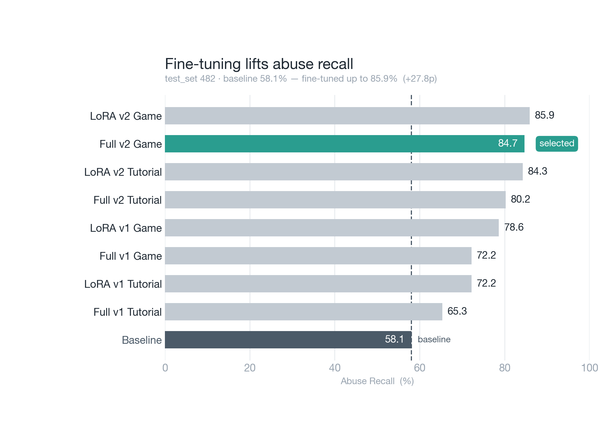
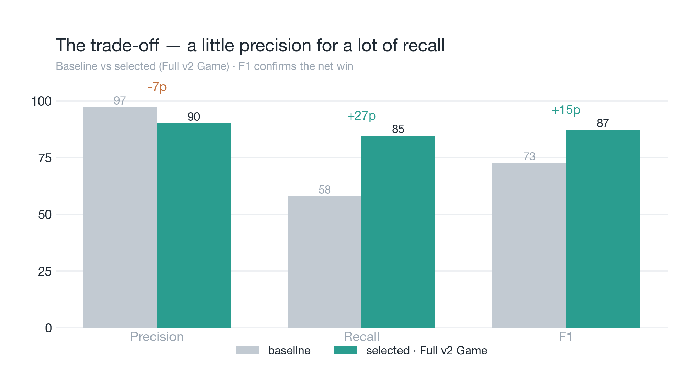
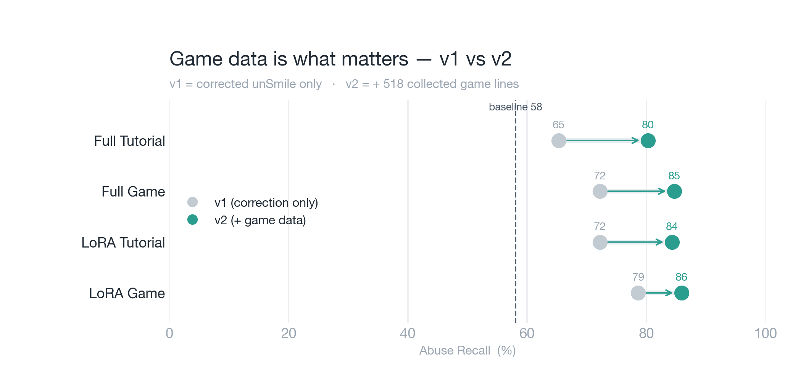

# 6_Model_Comparison — 9개 모델 비교 결과 (test_set 482)

baseline(파인튜닝 전) + 파인튜닝 8개를 **held-out `test_set`(482)** 으로 비교한 **메인 헤드라인**입니다.

- **abuse 판정**: `악플/욕설`(index 8) > 0.5 — 배포·Step 1·Step 2와 동일 정의 · **임계값 0.5**
- **지표**: Abuse/Clean Precision·Recall·F1 + **LRAP**(다중라벨 랭킹 품질, threshold 무관)
- 생성: `python compare_models.py` → `comparison_results.csv/.json` · 차트 `python plot_comparison.py`

## 🏆 헤드라인 — 파인튜닝으로 Abuse Recall 58 → 86%

한국어판: [`abuse_recall_before_after_ko.png`](./abuse_recall_before_after_ko.png)

> baseline 58.06%에서 파인튜닝 8개가 전부 기준선(점선)을 넘김. **최고 85.89%(LoRA v2 Game), 선정 84.68%(Full v2 Game)**.

## 🎯 결정타 — 공짜가 아니다: 정밀도를 내주고 재현율을 얻었다 (F1이 순이득 확인)

한국어판: [`tradeoff_baseline_vs_best_ko.png`](./tradeoff_baseline_vs_best_ko.png)

Recall만 보면 과장이다. **같이 봐야 정직하다**:

| | Precision | Recall | **F1** |
|---|:---:|:---:|:---:|
| Baseline | 97.3% | 58.1% | 72.7% |
| **Full v2 Game (선정)** | 90.1% | 84.7% | **87.3%** |
| 변화 | **−7p** | **+27p** | **+15p** |

- 파인튜닝은 **정밀도를 97→90%로 7p 내주는 대신**(오탐 4→23건) **재현율을 27p 끌어올렸다.**
- 게임에선 오탐 = 가짜 저주라 정밀도가 중요한데(Step 1), **F1이 72.7→87.3으로 +15p** 오른 게 *"이 트레이드는 순이득"* 이라는 증거다. → 그래서 **F1으로 의사결정**(Step 1과 동일 기준).

## 📊 전체 순위 (Abuse Recall 순)

| 모델 | Recall | F1 | Precision | LRAP | baseline 대비 |
|------|:---:|:---:|:---:|:---:|:---:|
| LoRA v2 Game | **85.89%** | 86.94% | 88.02% | 0.932 | +27.8p |
| **Full v2 Game** ✅ | 84.68% | **87.32%** | **90.13%** | **0.936** | +26.6p |
| LoRA v2 Tutorial | 84.27% | 82.45% | 80.69% | 0.908 | +26.2p |
| Full v2 Tutorial | 80.24% | 83.79% | 87.67% | 0.915 | +22.2p |
| LoRA v1 Game | 78.63% | 84.42% | 91.12% | 0.924 | +20.6p |
| LoRA v1 Tutorial | 72.18% | 79.91% | 89.50% | 0.902 | +14.1p |
| Full v1 Game | 72.18% | 81.00% | 92.27% | 0.911 | +14.1p |
| Full v1 Tutorial | 65.32% | 76.06% | 91.01% | 0.892 | +7.3p |
| Baseline | 58.06% | 72.73% | 97.30% | 0.887 | — |

## 🔬 핵심 인사이트

### 1. 게임 데이터(v2)가 결정적
 · 한국어판: [`v1_vs_v2_ko.png`](./v1_vs_v2_ko.png)

| | v1 (보정 unSmile만) | v2 (+ 게임 수집 518) | 차이 |
|---|:---:|:---:|:---:|
| 평균 Abuse Recall | 72.1% | **83.8%** | **+11.7%p** |

**모든 조합**에서 v2 > v1. 단 **518건의 게임 채팅**으로 +11.7%p. (v1도 Step 3 보정으로 게임 키워드 44건이 들어가 있어, 도메인 적응의 *대부분*은 v2의 수집 데이터가 만든 것)

### 2. LoRA ≈ Full · Game(KcELECTRA) > Tutorial(kcbert)
평균 Recall: LoRA 80.2% vs Full 75.6% / Game base 80.4% vs Tutorial 75.5%. **LoRA가 Full에 동등 이상(게다가 가벼움)**, base는 Game(KcELECTRA)이 우세.

## ✅ 선정 — Full v2 Game (Step 7)

> **상위 3개(LoRA v2 Game·Full v2 Game·LoRA v2 Tutorial)는 Recall이 통계적 동률** — LoRA v2 Game 85.89 vs Full v2 Game 84.68은 **482문장 중 단 3문장 차이**. 즉 "Recall 1등"은 noise이고, 변별은 **Precision·F1**에서 난다.

**Full v2 Game 선정** — **F1 87.32 / Precision 90.13 / LRAP 0.936 모두 1위**. Step 1에서 정한 *"오탐이 치명적이라 F1·정밀도로 고른다"* 기준과 정확히 일관.
- *대안*: **LoRA v2 Game** — Recall 1등 + LoRA(경량). 효율을 최우선하면 이쪽도 동급. (정밀도 88 vs 90으로 Full v2 Game이 가짜저주에 약간 더 안전 → 선정)

⚠️ 옛 문서의 best **`Full v2 Tutorial`**(구 187 기준)은 482에선 **4위(80.24%)** 로 밀림 → 선정·양자화 대상 변경 필요.

## 📈 그래프 읽는 법
- **① before/after** — 슬레이트=baseline 58.1%(점선 기준), 그 위 8개가 전부 파인튜닝. 틸+`선정`=Full v2 Game.
- **② trade-off** — Precision만 막대가 내려가고(−7p, 작은 비용), Recall·F1은 크게 오름(+27p·+15p). "F1 순이득"을 한 장으로.
- **③ v1 vs v2** — 회색(v1)→틸(v2) 화살표, 4조합 전부 상승 = 게임 데이터 효과.

## 📁 파일
| 파일 | 내용 |
| :--- | :--- |
| `compare_models.py` | 9모델 평가(index-8 + LRAP) → CSV/JSON |
| `plot_comparison.py` | 포트폴리오 차트 3종 en/ko — CSV 기반, 재추론 불필요 |
| `comparison_results.csv` · `.json` | 전체 수치(TP/TN/FP/FN 포함) |
| `_archive/` | 옛 game_test(187) 결과 백업 |

## ▶️ 다음 단계
[`../7_Best_Model_Selection`](../7_Best_Model_Selection)(Full v2 Game 확정) → [`../8_Quantization`](../8_Quantization)(선정 모델 INT8 재양자화)
