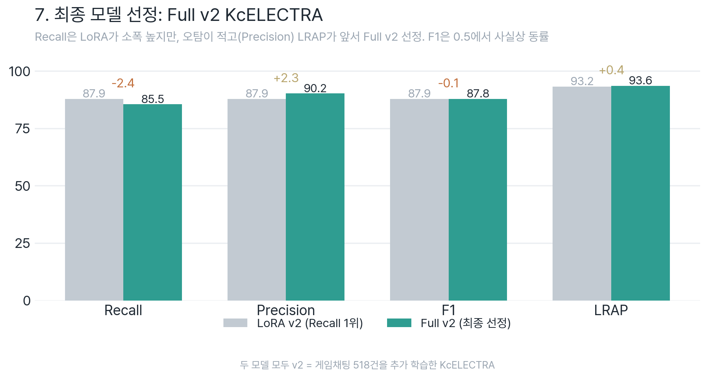

# 7_Best_Model_Selection, 최종 선정 모델 (test_set 482)

Step 6(9모델 비교)의 결론을 확정하는 단계입니다. **abuse 판정 = not-clean(clean이 아니면 부정어, 9개 라벨 max > 0.5)** (배포, Step 6, Step 8 동일 정의).



> 근거·그래프: [`../6_Model_Comparison/results/README.md`](../6_Model_Comparison/results/README.md)

## 🏆 선정, **Full v2 KcELECTRA**

| 항목 | 값 |
|------|:---|
| **표시명** | Full v2 KcELECTRA |
| **내부 폴더명** | `full_game_kcelectra_v2` |
| **베이스 모델** | `beomi/KcELECTRA-base-v2022` (이름의 `Game`=KcELECTRA base) |
| **파인튜닝 방식** | Full Fine-tuning (전체 가중치) |
| **학습 데이터(v2)** | UnSmile 보정 14,690 + 게임 수집 518 = **15,208건** |
| **경로** | `5_Full_Fine_Tuning/v2_corrected_plus_collected/output/full_game_kcelectra_v2/best_model` |

## 📊 성능 (test_set 482, not-clean)

| 지표 | Baseline | **Full v2 KcELECTRA** | 변화 |
|------|:--------:|:--------------:|:----:|
| **Abuse Recall** | 60.08% | **85.48%** | **+25.4%p** |
| **Abuse F1** | 73.95% | **87.78%** | **+13.8%p** |
| **Abuse Precision** | 96.13% | 90.21% | −5.9%p |
| **LRAP** | 0.887 | **0.936** | +0.05 |
| Clean F1 | 81.5% | 88.4% | +6.9%p |
| Accuracy | 77.6% | 87.3% | +9.7%p |

> **정직한 트레이드오프**: 정밀도를 6%p 내주는 대신(오탐 6→23건) 재현율을 25%p 끌어올렸고, **F1이 +13.8%p** 올라 *순이득*. 게임에선 오탐(=가짜저주)이 치명적이라(Step 1) 정밀도가 중요한데, 선정 모델은 **남은 모델 중 정밀도가 가장 높다(90.21%)**.

## 🎯 선정 이유, Step 1의 "F1·정밀도로 고른다"와 일관

1. **LRAP 1위 + 오탐 최소**, LRAP 0.936(1위), FP 23개(Recall 1위 LoRA v2는 30개), F1 87.78(LoRA v2와 동률), Precision 90.21.
2. **Recall 1등은 의미 없음(noise)**, 상위 3개(LoRA v2 KcELECTRA 87.90 · Full v2 KcELECTRA 85.48 · LoRA v2 kcbert 84.27)는 **482문장 중 3문장 차이**. 변별은 Precision과 LRAP에서 나고, 거기서 Full v2 KcELECTRA가 1위(F1은 LoRA v2와 동률).
3. **게임 안전성**, 가짜저주를 줄이는 정밀도가 후보 중 최고.

### 대안
- **LoRA v2 KcELECTRA** (`lora_game_kcelectra_v2`), Recall 1등(87.90%) + LoRA(경량). 학습·배포 효율을 최우선하면 동급 선택. (정밀도 88.0 vs 90.1로 Full v2 KcELECTRA가 가짜저주에 약간 더 안전 → 본 선정)

> ⚠️ 옛 문서의 best **Full v2 kcbert**(`full_tutorial_kcbert_v2`, 구 game_test 187 기준)는 test_set(482)에선 **4위(Recall 80.24%)** 로 밀렸습니다, 그래서 재선정.

## 💻 모델 로드

```python
from transformers import AutoTokenizer, AutoModelForSequenceClassification

MODEL_PATH = "../5_Full_Fine_Tuning/v2_corrected_plus_collected/output/full_game_kcelectra_v2/best_model"
tokenizer = AutoTokenizer.from_pretrained("beomi/KcELECTRA-base-v2022")
model = AutoModelForSequenceClassification.from_pretrained(MODEL_PATH).eval()

# 추론: abuse = sigmoid(logits)[8] > 0.5  (악플/욕설, 배포와 동일)
```

## ▶️ 다음 단계
[`../8_Quantization`](../8_Quantization), **이 모델(Full v2 KcELECTRA)을 기준으로 압축/배포 최적화 완료**.

최신 결론은 **FP16 압축 모델 권장**입니다. INT8 Dynamic은 크기·속도 개선은 있지만 fixed threshold 0.5에서 Recall이 크게 떨어져, threshold 보정과 운영 false-positive 검토 없이는 배포하지 않는 것이 안전합니다.

## 📋 한 줄 요약
> **Full v2 KcELECTRA**(KcELECTRA base · Full FT · 게임데이터) 선정, test_set(482)에서 **LRAP 0.936 1위 · 오탐 FP 23개로 최소 · F1 87.78%(+13.8%p, LoRA v2와 동률) · Precision 90.21%**. Step 1의 정밀도 기준과 일관.
