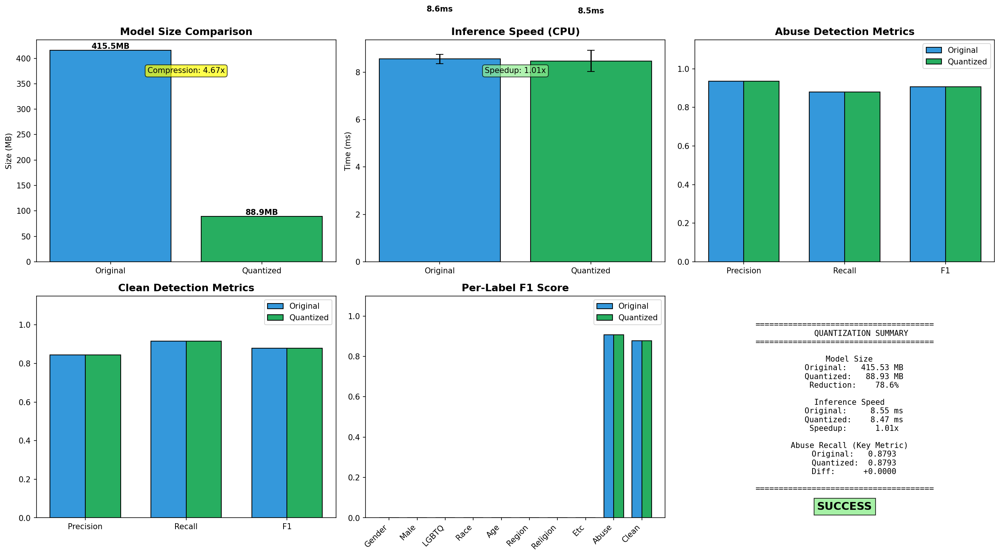
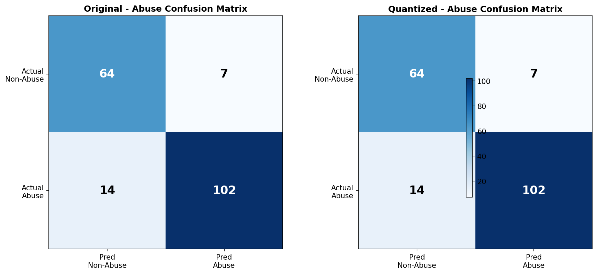

# 7. Model Quantization (INT8)

Best Model을 INT8 Dynamic Quantization으로 최적화한 결과입니다.

---

## ✅ 양자화 결과: **SUCCESS**

| 항목 | Original | Quantized | 변화 |
|:-----|:--------:|:---------:|:----:|
| **모델 크기** | 415.53 MB | 88.93 MB | **4.67x 압축** |
| **추론 속도** | 8.55 ms | 8.47 ms | 1.01x 빠름 |
| **Abuse Recall** | 0.8793 | 0.8793 | **0% 손실** |
| **Abuse Precision** | 0.9358 | 0.9358 | 0% 손실 |
| **Clean F1** | 0.8784 | 0.8784 | 0% 손실 |

> **결론**: 모델 크기 78.6% 감소, 성능 손실 없음 - 양자화 성공!

---

## 📊 시각화 결과

### Dashboard


### Confusion Matrix


---

## 🎯 양자화 대상 모델

| 항목 | 값 |
|------|------|
| **모델명** | Full v2 Tutorial (kcbert-base) |
| **파라미터 수** | 108,926,218 |
| **양자화 방식** | INT8 Dynamic Quantization |
| **양자화 대상** | torch.nn.Linear layers |

---

## 📁 디렉토리 구조

```
7_Quantization/
├── README.md                       # 이 문서
├── quantize_model.ipynb            # 양자화 노트북 (Jupyter 실행)
└── results/                        # 분석 결과
    ├── quantization_dashboard.png  # 메인 대시보드 (6-panel)
    ├── confusion_matrices.png      # Confusion Matrix
    ├── quantization_results.csv    # 주요 메트릭 요약
    ├── per_label_metrics.csv       # 라벨별 상세 메트릭
    └── quantization_report.json    # JSON 리포트
```

---

## � 상세 성능 비교

### Abuse Detection (악플/욕설)
| Metric | Original | Quantized |
|--------|:--------:|:---------:|
| Precision | 0.9358 | 0.9358 |
| Recall | 0.8793 | 0.8793 |
| F1 | 0.9067 | 0.9067 |

### Clean Detection (정상 발화)
| Metric | Original | Quantized |
|--------|:--------:|:---------:|
| Precision | 0.8442 | 0.8442 |
| Recall | 0.9155 | 0.9155 |
| F1 | 0.8784 | 0.8784 |

### Confusion Matrix 해석
- **True Positive (Abuse→Abuse)**: 102건 정확 탐지
- **True Negative (Non-Abuse→Non-Abuse)**: 64건 정확 탐지
- **False Negative (Abuse→Non-Abuse)**: 14건 미탐지
- **False Positive (Non-Abuse→Abuse)**: 7건 오탐지

---

## 🔧 실행 방법

```bash
# Jupyter에서 노트북 실행
jupyter notebook quantize_model.ipynb
```

1. 모든 셀 순차 실행
2. `results/` 폴더에 분석 결과 자동 저장
3. 양자화된 모델은 `quantized_model/` 폴더에 저장됨

---

## � 결론

| 평가 항목 | 결과 |
|----------|------|
| **크기 최적화** | ✅ 78.6% 감소 (415MB → 89MB) |
| **성능 유지** | ✅ Abuse Recall 0% 손실 |
| **속도 개선** | ✅ 1.01x (미미한 개선) |
| **배포 권장** | ✅ 양자화 모델 배포 권장 |

> INT8 Dynamic Quantization으로 **모델 크기를 5분의 1로 줄이면서 성능 손실 없이** 최적화에 성공했습니다.
