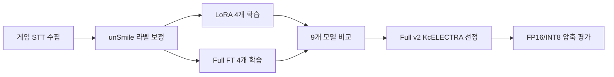

# EchoForest AI 욕설 탐지 시스템 — 발표 자료 초안

최신 실험 기준 발표 흐름입니다. 수치는 `test_set.tsv` 482건 기준이며, 최종 모델은 **Full v2 KcELECTRA**, 압축 배포 후보는 **FP16**입니다.

## 슬라이드 1. 시스템 개요

### 제목
협동 게임 음성채팅 기반 부정 발언 탐지

### 핵심 메시지
플레이어의 음성 발화를 STT로 텍스트화하고, AI 모델이 부정 발언 여부를 판단해 저주 시스템에 반영합니다.

```text
Web Speech API → Spring WebSocket → FastAPI AI 모델 → 저주 스택
```

### 발표 포인트
- 단순 키워드 필터가 아니라 게임 맥락의 비난/욕설을 분류
- 정상 오더를 욕설로 오탐하면 UX가 깨지므로 Precision도 중요
- 실시간 처리를 위해 모델 압축과 추론 속도도 함께 검토

## 슬라이드 2. 문제 정의

### 제목
기본 모델은 오탐은 적지만 게임 비난을 많이 놓쳤다

| 모델 | Precision | Recall | F1 | FP | FN |
|------|:---:|:---:|:---:|:---:|:---:|
| Baseline `kor_unsmile` | 97.30% | 58.06% | 72.73% | 4 | 104 |

### 발표 포인트
- `kor_unsmile`은 한국어 악성 댓글 모델이라 직접 욕설에는 강함
- 하지만 "너 때문에 죽잖아", "제대로 좀 해" 같은 게임 맥락 비난은 확률이 0.5 아래로 내려가 자주 미탐
- threshold를 낮추면 정상 게임 오더까지 과탐할 수 있어 fine-tuning이 필요

## 슬라이드 3. 데이터와 실험 설계

### 제목
게임 도메인 데이터를 분리해 학습과 평가를 설계

| 데이터 | 건수 | 역할 |
|--------|:---:|------|
| 보정 unSmile train | 14,690 | 기본 학습 데이터 |
| 게임 수집 데이터 | 518 | v2 학습에 추가 |
| held-out test_set | 482 | 최종 평가 |

### 발표 포인트
- `test_set`은 학습 데이터와 overlap 0으로 검증
- LoRA/Full, v1/v2, KcELECTRA/kcbert 조합으로 8개 모델 학습
- baseline 포함 총 9개 모델을 같은 기준으로 비교

## 슬라이드 4. 파이프라인

### 제목
데이터 보정에서 압축 배포까지 이어지는 AI 고도화



### 발표 포인트
- 라벨 보정으로 기본 데이터의 게임 부정어 인식 문제를 줄임
- 518건의 게임 데이터를 추가한 v2 모델들이 전반적으로 우세
- 최종 선정 후에도 바로 배포하지 않고 압축 성능까지 검증

## 슬라이드 5. 모델 비교 결과

### 제목
Fine-tuning으로 Recall 58.06% → 84.68%

| 지표 | Baseline | Full v2 KcELECTRA | 변화 |
|------|:---:|:---:|:---:|
| Precision | 97.30% | 90.13% | -7.17%p |
| Recall | 58.06% | 84.68% | +26.62%p |
| F1 | 72.73% | 87.32% | +14.59%p |
| LRAP | 0.887 | 0.936 | +0.049 |

### 권장 그래프
- `6_Model_Comparison/results/paper_selected_tradeoff_ko.png`
- `6_Model_Comparison/results/paper_model_ranking_ko.png`

### 발표 포인트
- Precision은 일부 낮아졌지만 Recall과 F1이 크게 개선
- 게임 UX상 오탐이 중요하므로 Recall만 보지 않고 F1·Precision으로 최종 판단

## 슬라이드 6. 게임 도메인 데이터 효과

### 제목
518건의 게임 데이터가 성능 개선의 핵심

| 비교 | v1 평균 Recall | v2 평균 Recall | 차이 |
|------|:---:|:---:|:---:|
| 평균 | 72.1% | 83.8% | +11.7%p |

### 권장 그래프
- `6_Model_Comparison/results/paper_domain_data_effect_ko.png`

### 발표 포인트
- 같은 base/학습방식에서도 v2가 v1보다 모두 우세
- 모델 구조보다 도메인 데이터가 실제 게임 발화 탐지에 더 직접적인 효과를 냄

## 슬라이드 7. 최종 모델 선정

### 제목
Full v2 KcELECTRA 선정

| 후보 | Recall | F1 | Precision | LRAP |
|------|:---:|:---:|:---:|:---:|
| LoRA v2 KcELECTRA | 85.89% | 86.94% | 88.02% | 0.932 |
| **Full v2 KcELECTRA** | 84.68% | **87.32%** | **90.13%** | **0.936** |

### 발표 포인트
- Recall만 보면 LoRA v2 KcELECTRA가 1위
- 하지만 차이는 482문장 중 약 3문장 수준
- Full v2 KcELECTRA는 F1·Precision·LRAP 모두 1위라 최종 선택이 더 안전

## 슬라이드 8. 압축/배포 최적화

### 제목
INT8은 빠르지만 fixed threshold 성능 손실, FP16이 안전

| 모델 | 크기 | CPU 지연시간 | Recall | F1 | 판단 |
|------|:---:|:---:|:---:|:---:|------|
| 원본 | 487.48 MiB | 34.04 ms | 84.68% | 87.32% | 기준 |
| INT8 | 242.88 MiB | 14.01 ms | 70.16% | 81.50% | 비권장 |
| FP16 | 243.75 MiB | 13.90 ms | 84.68% | 87.32% | **권장** |

### 권장 그래프
- `8_Quantization/results/quantization_dashboard_ko.png`
- `8_Quantization/results/confusion_matrices_ko.png`
- `8_Quantization/results/threshold_sweep_ko.png`

### 발표 포인트
- INT8은 크기/속도는 좋아졌지만 abuse 미탐이 38→74건으로 증가
- threshold 0.21 보정 시 F1은 회복되지만 오탐이 증가해 운영 검토 필요
- FP16은 원본 성능을 그대로 유지하면서 2배 압축되어 배포 후보로 가장 안전

## 슬라이드 9. 최종 요약

### 제목
데이터 기반 fine-tuning은 성공, 배포 압축은 FP16 우선

| 항목 | 결과 |
|------|------|
| 최종 모델 | Full v2 KcELECTRA |
| 성능 개선 | Recall 58.06% → 84.68%, F1 72.73% → 87.32% |
| 핵심 원인 | 게임 도메인 데이터 518건 추가 |
| 권장 압축 | FP16 |
| INT8 판단 | threshold 보정 후 재검토 |

### 한 줄 스크립트
> 기본 unSmile은 오탐은 적지만 게임 맥락의 부정 발언을 많이 놓쳤고, 게임 도메인 fine-tuning으로 F1을 72.73%에서 87.32%까지 끌어올렸습니다. 배포 단계에서는 INT8 fixed threshold가 Recall을 훼손해, 현재는 성능을 보존하는 FP16 압축 모델이 가장 안전한 선택입니다.
