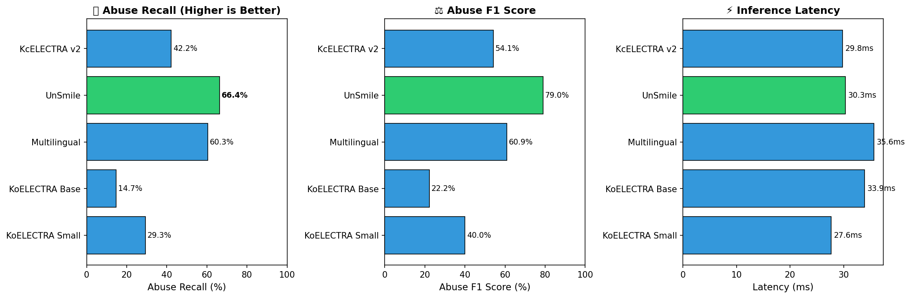
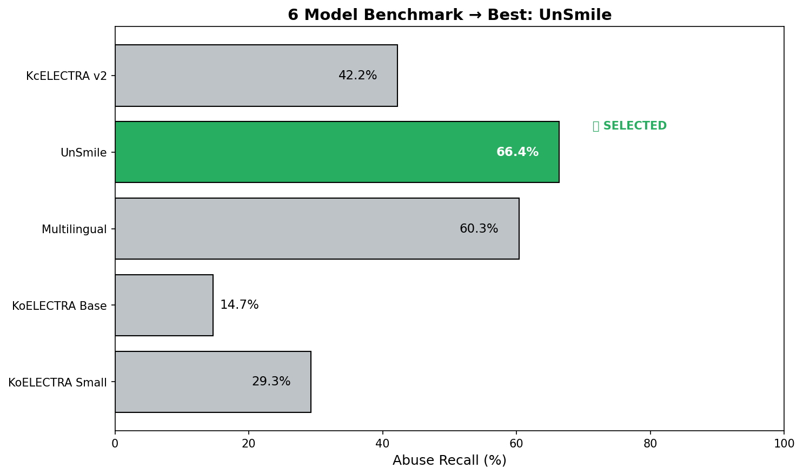
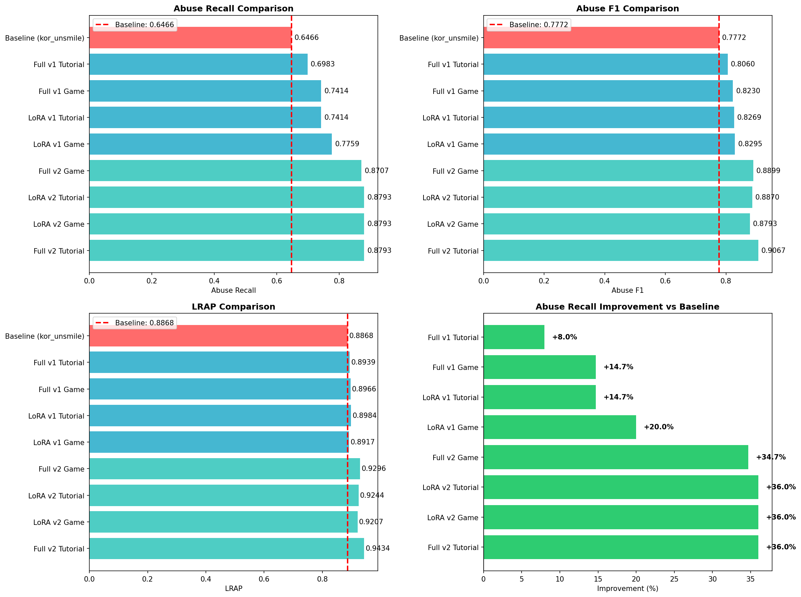
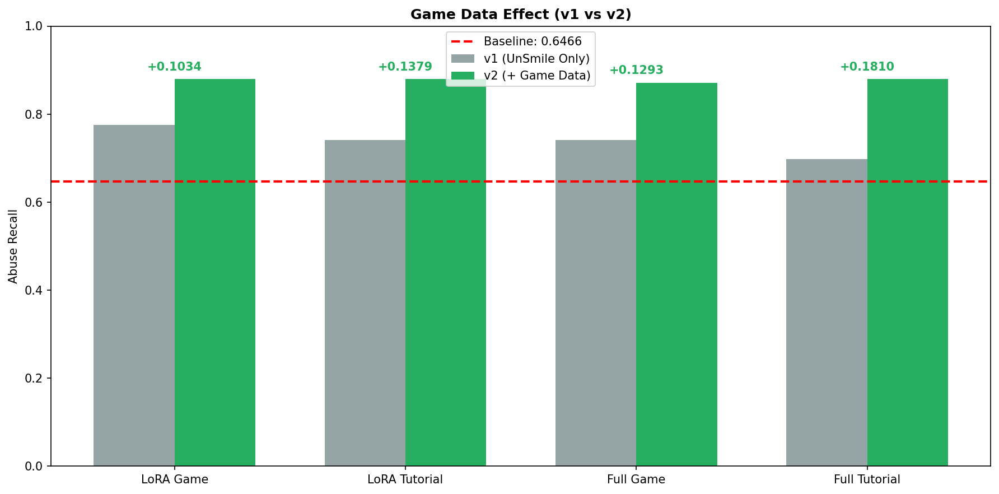
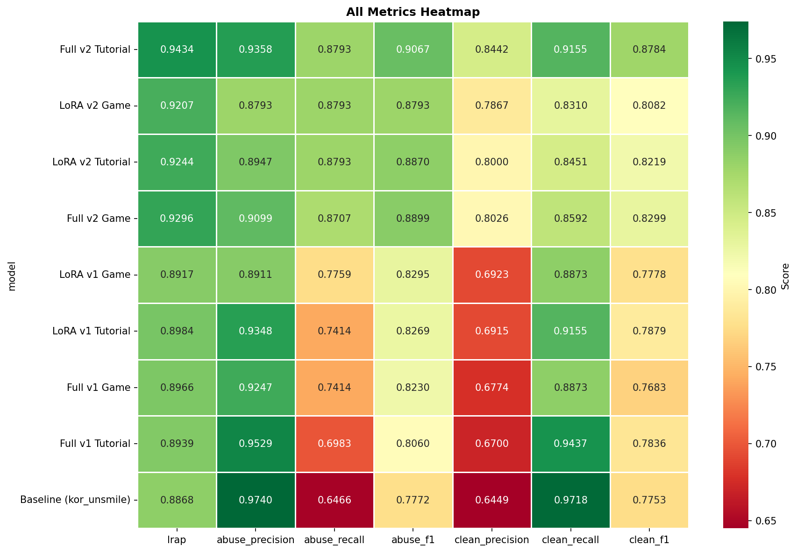

# 🎮 AI 감정 분석 시스템 - PPT 자료 (2-3분)

---

## 📍 슬라이드 1: 시스템 개요

### 제목
**협동 게임 부정어 감지 및 저주 시스템**

### 발표 내용 (30초)
저희 협동 게임에서는 플레이어가 부정적인 말을 하면 저주 스탯이 증가합니다.

| 심각도 | 예시 | 저주 스탯 |
|:------:|------|:--------:|
| **1단계 (심각)** | 심한 욕설, 폭언 | **+5** |
| **2단계 (중간)** | 비난, 비속어 | **+3** |
| **3단계 (경미)** | 부정적 표현 | **+1** |

> **핵심**: AI가 실시간으로 음성/텍스트를 분석하여 심각도를 판단합니다.

---

## 📍 슬라이드 2: 모델 선정 - 5개 모델 비교

### 제목
**5개 감정 분석 모델 벤치마크**

### 이미지



### 발표 내용 (40초)
게임 STT 데이터 187건으로 5개 모델을 비교했습니다.

| 모델 | Abuse Recall | 선정 |
|------|:------------:|:----:|
| **UnSmile** | **66.4%** | ✅ |
| Multilingual | 60.3% | |
| KcELECTRA v2 | 42.2% | |
| KoELECTRA Base | 14.7% | |
| KoELECTRA Small | 29.3% | |

### UnSmile 선정 이유
1. **최고 성능**: Abuse Recall 66.4%로 1위
2. **한국어 특화**: Smilegate AI에서 개발한 한국어 혐오 발언 전용 모델
3. **댓글/채팅 기반**: 게임 대화와 유사한 데이터로 학습됨

---

## 📍 슬라이드 3: 문제점 및 개선 필요성

### 제목
**UnSmile 모델의 한계**

### 발표 내용 (30초)
하지만 UnSmile 모델에는 몇 가지 한계가 있었습니다:

**문제점:**
- 일반 댓글 데이터로 학습 → 게임 특유 표현 인식 부족
- 채팅 약어 기반: "ㅅㅂ", "ㅋㅋ" 같은 데이터셋 포함
- 게임 상황 오탐: "죽어 죽어"(몬스터에게), "피해 피해" 등을 욕설로 오인

**Baseline 성능:**
- 악플/욕설 Recall: **64.66%** (개선 필요!)

> **해결책**: 게임 도메인에 특화된 Fine-tuning 진행

---

## 📍 슬라이드 4: Fine-tuning 파이프라인

### 제목
**AI 모델 고도화 파이프라인**

### 발표 내용 (40초)

```
┌─────────────────────────────────────────────────────┐
│  Step 1: 데이터 수집                                 │
│          - 게임 STT 518건 (학습용)                   │
│          - 게임 STT 187건 (테스트용)                 │
│                    ↓                                 │
│  Step 2: Baseline 분석 → 문제점 파악                 │
│                    ↓                                 │
│  Step 3: UnSmile 데이터 보정 (14,690건)              │
│                    ↓                                 │
│  Step 4: Fine-tuning                                │
│          - LoRA Fine-tuning (4개 모델)               │
│          - Full Fine-tuning (4개 모델)               │
│                    ↓                                 │
│  Step 5: 9개 모델 비교 → 최적 모델 선정              │
│                    ↓                                 │
│  Step 6: INT8 양자화 (배포 최적화)                   │
└─────────────────────────────────────────────────────┘
```

---

## 📍 슬라이드 5: Fine-tuning 결과 - Before/After

### 제목
**Fine-tuning 결과: +36% 성능 향상**

### 이미지


### 발표 내용 (30초)

| 지표 | Before (Baseline) | After (Best) | 개선 |
|------|:-----------------:|:------------:|:----:|
| **Abuse Recall** | 64.66% | **87.93%** | **+36.0%** |
| **Abuse F1** | 77.72% | **90.67%** | **+16.7%** |
| **LRAP** | 88.68% | **94.34%** | **+6.4%** |

> **핵심 발견**: 518건의 게임 데이터로 +36% 성능 향상 달성!

---

## 📍 슬라이드 6: 게임 데이터의 효과 (v1 vs v2)

### 제목
**도메인 데이터의 중요성**

### 이미지


### 발표 내용 (20초)

| 데이터 버전 | 평균 Abuse Recall | 차이 |
|-------------|:-----------------:|:----:|
| v1 (일반 데이터만) | 73.93% | - |
| v2 (+ 게임 데이터 518건) | **87.72%** | **+13.8%p** |

> **결론**: 소량의 도메인 특화 데이터가 모델 성능에 결정적인 영향!

---

## 📍 슬라이드 7: 9개 모델 상세 비교

### 제목
**9개 모델 성능 히트맵**

### 이미지


### 발표 내용 (20초)
LoRA vs Full Fine-tuning, v1 vs v2 조합으로 8개 모델을 학습했습니다.

**최종 선정: Full v2 Tutorial**
- Abuse Recall: 87.93%
- Abuse F1: 90.67%
- LRAP: 94.34%

---

## 📍 슬라이드 8: 양자화 (배포 최적화)

### 제목
**INT8 양자화: 4.67배 압축, 성능 손실 0%**

### 이미지


### 발표 내용 (20초)

| 항목 | Before | After | 변화 |
|------|:------:|:-----:|:----:|
| **모델 크기** | 415.53 MB | **88.93 MB** | **4.67x 압축** |
| **추론 속도** | 8.55 ms | 8.47 ms | 1.01x 빠름 |
| **Abuse Recall** | 87.93% | **87.93%** | **0% 손실** |

> **결론**: 모델 크기 78.6% 감소, 성능 손실 없음!

---

## 📍 슬라이드 9: 최종 요약

### 제목
**AI 감정 분석 시스템 요약**

### 발표 내용 (20초)

### 🏆 최종 성과
| 항목 | 결과 |
|------|------|
| **모델** | Full v2 Tutorial (INT8 Quantized) |
| **성능 개선** | Recall 64.66% → 87.93% (+36%) |
| **모델 크기** | 415MB → 89MB (4.67x 압축) |

### 핵심 한 줄 요약
> **518건의 게임 데이터로 욕설 탐지율 65% → 88% (+36%),**  
> **양자화로 모델 크기 5분의 1 축소 달성! 🎉**

---

## 📂 이미지 파일 목록

PPT에 추가할 이미지 파일들입니다:

| 슬라이드 | 파일명 | 설명 |
|:--------:|--------|------|
| 2 | `ppt_images/01_model_comparison.png` | 5개 모델 비교 차트 |
| 2 | `ppt_images/02_best_model_selection.png` | 모델 선정 결과 |
| 5 | `ppt_images/03_before_after.png` | Fine-tuning 전후 비교 |
| 6 | `ppt_images/04_v1_vs_v2.png` | 게임 데이터 효과 (v1 vs v2) |
| 7 | `ppt_images/05_metrics_heatmap.png` | 9개 모델 성능 히트맵 |
| 8 | `ppt_images/06_quantization.png` | 양자화 대시보드 |

> 이미지 파일은 `ppt_images` 폴더에 있습니다.

---

## 🎤 발표 스크립트 요약 (약 2분 30초)

1. **시스템 개요** (30초): 저주 시스템 소개 - 심각도 1/2/3단계로 저주 스탯 +5/+3/+1
2. **모델 선정** (40초): 5개 모델 중 UnSmile 선정 이유 (최고 성능, 한국어 특화)
3. **문제점** (30초): UnSmile 한계 - 게임 특유 표현 인식 부족, 오탐 문제
4. **파이프라인** (40초): 데이터 수집 → Baseline 분석 → Fine-tuning → 양자화
5. **결과** (50초): +36% 성능 향상, 게임 데이터 효과, 4.67x 압축 성공
