# 🌲 메아리의 숲 (Echo Forest)

> ### "나쁜 말은 저주가 되어, 좋은 말은 길이 되어 돌아오는 곳"
>
> 감정의 힘으로 움직이는 메아리의 숲에서 펼쳐지는 4인 협동 모험. 플레이어의 **말(부정어·긍정어)**이 실제 게임 플레이에 영향을 주는 AI 감정 인식 기반 멀티플레이어 웹게임입니다.

- **서비스명**: 메아리의 숲 (Echo Forest)
- **개발 기간**: 2026.01.06 ~ 2026.02.09
- **개발 인원**: 6명 (Frontend 2 · AI 2 · Backend 2)

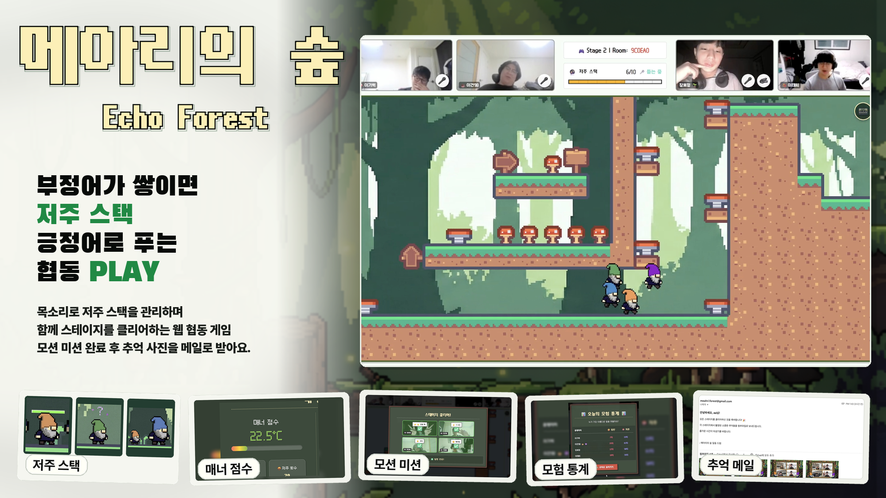

# 목차

- [프로젝트 개요](#프로젝트-개요)
- [서비스 기획 배경](#서비스-기획-배경)
- [게임 가이드](#게임-가이드)
- [주요 화면 및 기능 소개](#주요-화면-및-기능-소개)
- [시스템 아키텍처](#시스템-아키텍처)
- [API 명세](#api-명세)
- [디렉토리 구조](#디렉토리-구조)
- [AI 상세 문서](#ai-상세-문서)
- [영상 포트폴리오](#영상-포트폴리오)
- [팀원 소개](#팀원-소개)
- [FAQ 및 주의사항](#faq-및-주의사항)
- [기술 스택](#기술-스택)

# 프로젝트 개요

### 📖 프로젝트 소개
**메아리의 숲**은 **AI 감정 인식 기술 기반의 4인 협동 멀티플레이어 어드벤처 웹게임 서비스**입니다.
플레이 중 사용자의 **말(부정어, 긍정어)**이 실제 게임 플레이에 영향을 주는 것이 핵심 특징입니다.

### 🎯 프로젝트 목표
협동 상황에서 '말'이 팀 플레이에 미치는 영향을 직접 체험할 수 있습니다.
- **부정적인 발언** 🤬 → **페널티(저주)** 발생
- **긍정적인 발언** 😍 → **구원(해제)** 발생

오프라인 만남이 줄어든 현대 사회에서, 물리적 거리를 넘어 정서적 유대감을 회복할 수 있는 공간을 지향합니다.
단순한 오락을 넘어, 화상과 음성으로 함께 웃으며 단절된 관계를 잇는 **따뜻한 디지털 소셜 공간**입니다.

# 서비스 기획 배경

- **온라인 소통의 문제 의식**: 익명성에 기댄 비난은 쉽지만, 다정함과 공감은 어려운 현대의 온라인 환경.
- **작은 반항**: 자극적인 표현이 난무하는 세태 속에서, 언어적 책임감을 느끼고 긍정적 표현의 가치를 재발견하고자 합니다.
- **게임적 허용**: 강압적인 검열 대신, "사랑해", "좋아해" 같은 다정한 말이 위기를 극복하는 열쇠가 되도록 설계하여 자연스러운 긍정 소통을 유도합니다.

# 게임 가이드

### 💻 실행 환경
- **브라우저**: Chrome (필수)
- **입력 장치**: 키보드, 마이크(필수), 웹캠(필수)
- **권장 사항**: 이어폰/헤드셋 착용 (하울링 방지)

### 🎮 조작법
| 동작 | 키 (Key) | 설명 |
| :--- | :---: | :--- |
| **이동** | `←`, `→` | 좌우 이동 |
| **점프** | `↑` | 점프 |
| **소통** | `마이크` | 실시간 음성 대화 |

> **협동 팁**: 혼자서는 통과할 수 없는 구간이 많습니다. "하나, 둘, 셋!" 구호에 맞춰 움직이세요!

### ☠️ 저주 / 해제 규칙
- 부정적인 말을 하면 '부정 스택'이 쌓입니다. (**1단계 욕설 +5 · 2단계 비난 +3 · 3단계 부정 +1**)
- 스택이 가득 차면 랜덤 1명에게 **저주**가 발동됩니다.
- 저주는 스스로 해제할 수 없고, 동료의 **긍정어**("사랑해", "좋아해", "뽀뽀")가 필요합니다.

# 주요 화면 및 기능 소개

## 🎬 게임 화면

<table>
  <tr>
    <th>메인 / 로비</th>
    <th>대기실</th>
    <th>내 정보</th>
  </tr>
  <tr>
    <td align="center">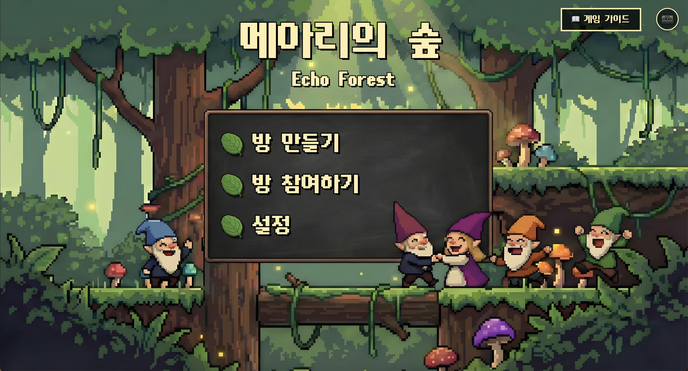</td>
    <td align="center">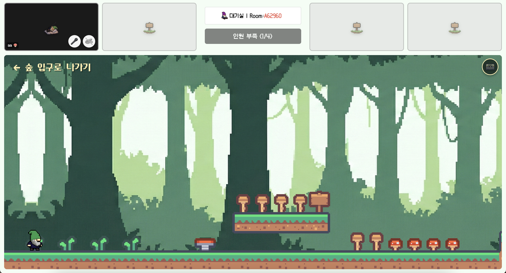</td>
    <td align="center">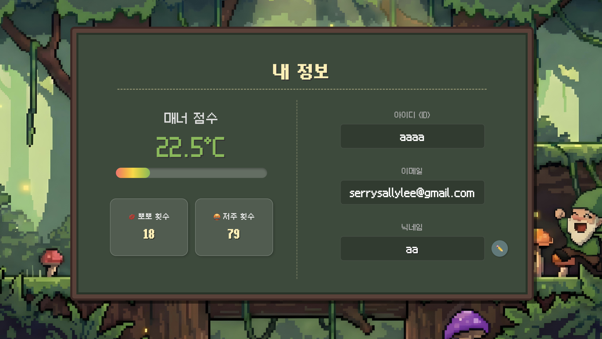</td>
  </tr>
</table>

- 방을 만들어 친구를 초대하거나 매칭으로 **4인 파티**를 구성하고, 카메라·마이크를 켠 채 함께 게임을 준비합니다.

<p align="center">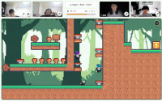</p>

> 실제 인게임 플레이 — 4인이 함께 숲을 모험하는 협동 플랫포머

## 🗣️ 음성 인식 → 저주 스택

<p align="center">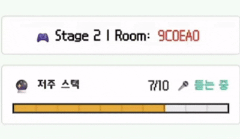</p>

- 플레이어의 음성을 **Web Speech API**로 텍스트화하고 **5초 단위로 배치**해 AI 서버로 전송합니다.
- **AI 모델**이 발화의 부정어 심각도를 판정해 저주 스택을 실시간으로 쌓습니다. (`+5 / +3 / +1`)
- 스택이 가득 차면 랜덤 1명에게 **저주가 발동**되어 협동 플레이를 위협합니다.

## ☠️ 저주 시스템

<table>
  <tr>
    <th>거대화</th>
    <th>반전</th>
    <th>시한폭탄</th>
  </tr>
  <tr>
    <td align="center">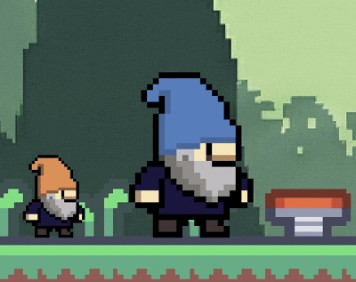</td>
    <td align="center">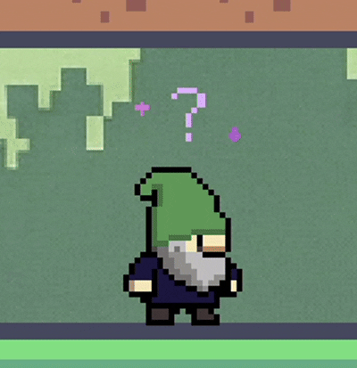</td>
    <td align="center">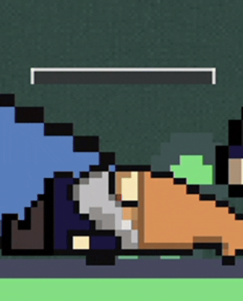</td>
  </tr>
</table>

- **거대화** — 크기 2배 · 이동/점프력 감소
- **반전** — 방향키 조작 반대
- **시한폭탄** — 5초 내 미해제 시 즉사
- 부정 스택이 가득 차면 위 **3종 저주** 중 하나가 랜덤으로 발동됩니다.
- 저주는 **본인이 풀 수 없고**, 동료의 긍정어로 **FIFO 순서**대로 해제됩니다.

<table>
  <tr>
    <th>저주 없음</th>
    <th>저주 발동 (1명)</th>
    <th>저주 발동 (2명)</th>
    <th>저주 해제</th>
  </tr>
  <tr>
    <td align="center">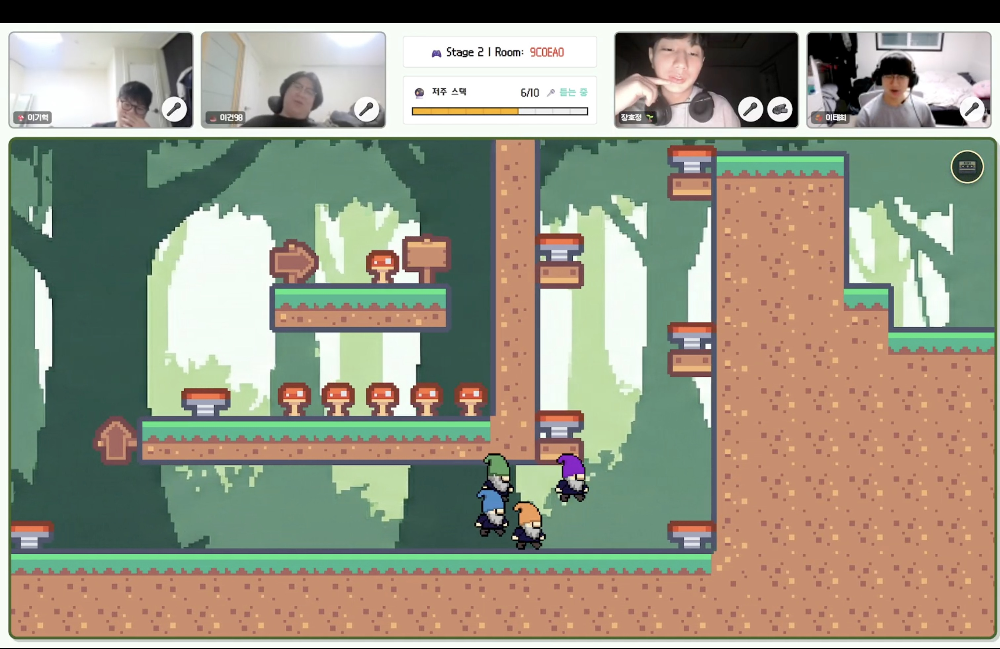</td>
    <td align="center">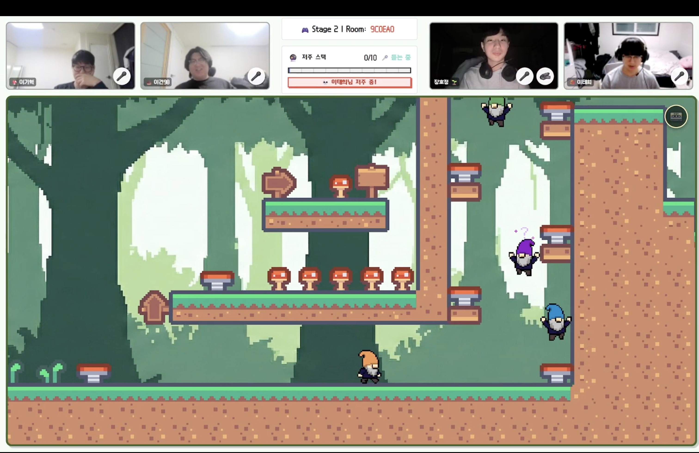</td>
    <td align="center">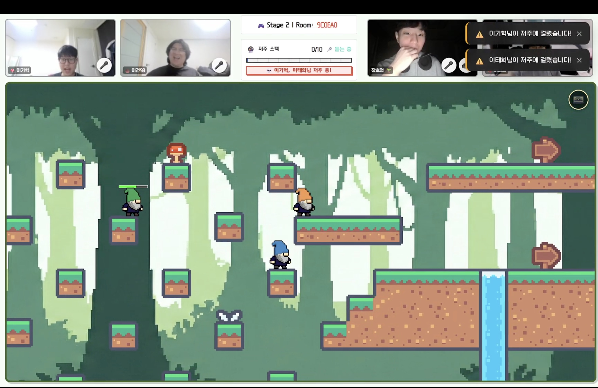</td>
    <td align="center">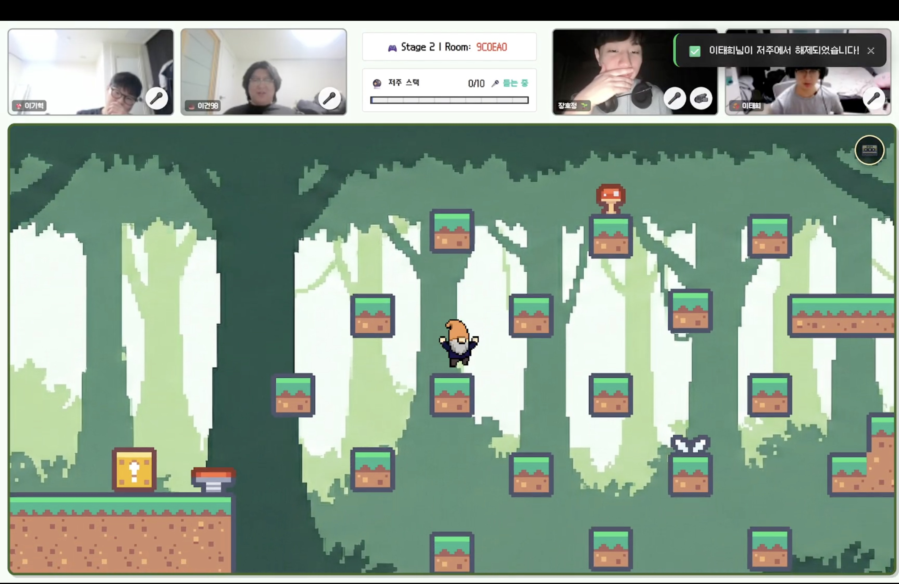</td>
  </tr>
</table>

- 저주에 걸린 동료는 머리 위 아이콘으로 표시되며, 긍정어 발화로 해제되는 과정을 한눈에 확인할 수 있습니다.

## 🧩 협동 스테이지 기믹

<p align="center"><b>Stage 1</b></p>
<p align="center">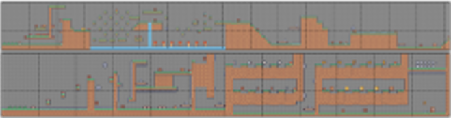</p>

<p align="center"><b>Stage 2</b></p>
<p align="center">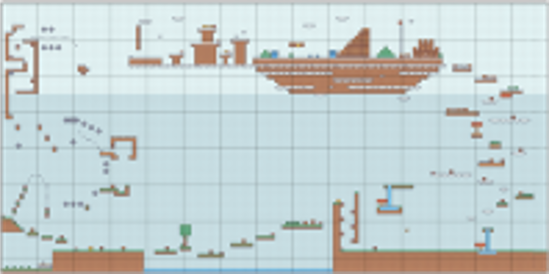</p>

- 혼자서는 통과할 수 없는 **협동 퍼즐과 기믹**을 호흡을 맞춰 클리어합니다.
- 각 스테이지의 **레벨 전체 구조**가 한눈에 담기도록 설계해, 팀이 경로를 함께 계획합니다.

## 📸 모션 인식 엔딩 미션

<p align="center">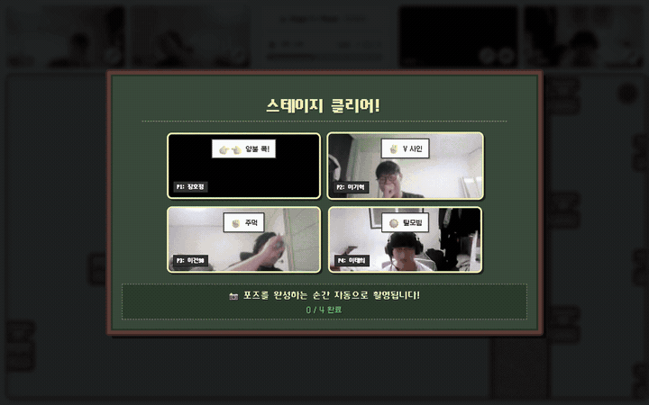</p>

- 스테이지 클리어 후 **MediaPipe**로 14종 포즈를 실시간 인식합니다.
- **4명 모두** 배정된 포즈를 성공하면 기념 사진이 자동 촬영됩니다.

## 📊 게임 완료 통계

<p align="center">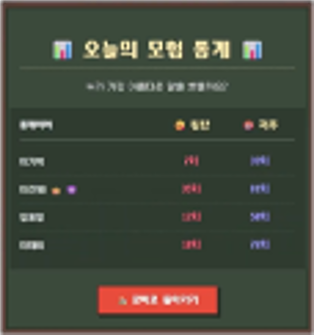</p>

- 게임 종료 후 **플레이 시간·저주 발동/해제 횟수·발화 통계** 등을 요약해 함께한 모험을 돌아봅니다.

## 💌 추억 저장 & 이메일

<table>
  <tr>
    <th>갤러리</th>
    <th>이메일</th>
    <th>전송</th>
  </tr>
  <tr>
    <td align="center"></td>
    <td align="center">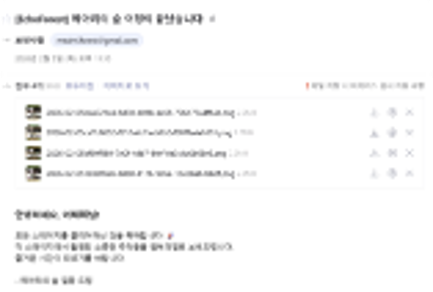</td>
    <td align="center">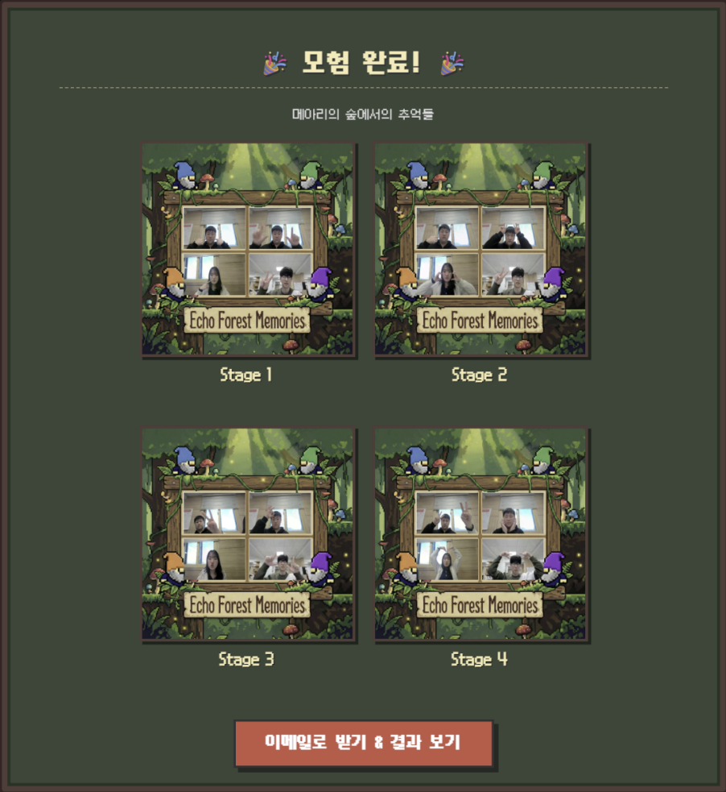</td>
  </tr>
</table>

- 자동 촬영된 게임 스냅샷을 갤러리에 저장하고 **이메일로 전송**해 추억으로 간직합니다.

# 시스템 아키텍처

### 🏗️ Architecture Overview
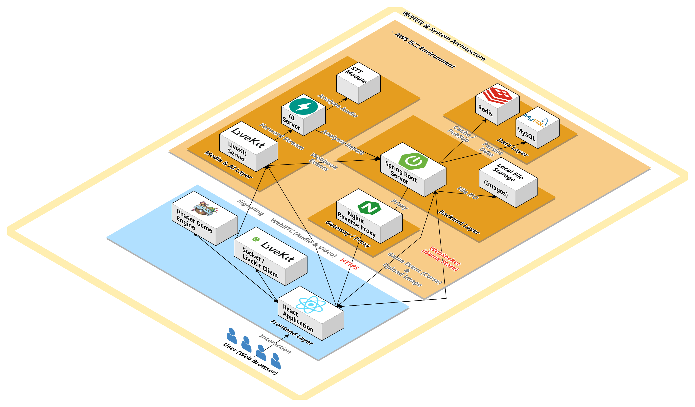

### 🔄 CI/CD Pipeline
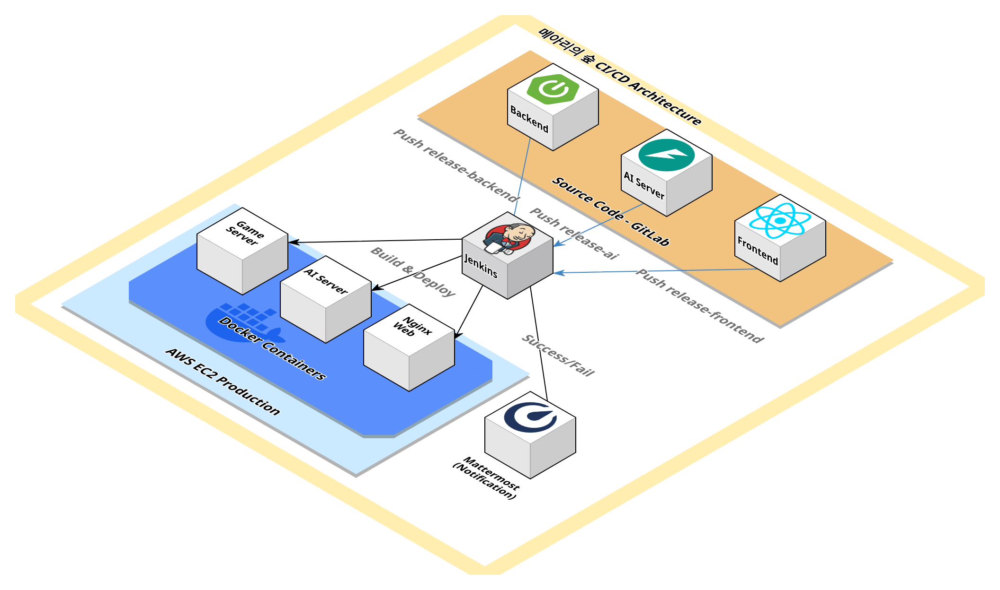

### 🧩 Usecase Diagram
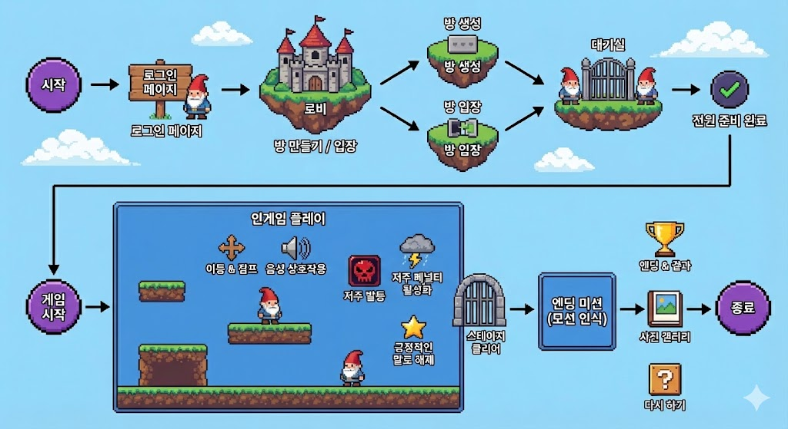

# API 명세

### Game Server (Spring Boot)
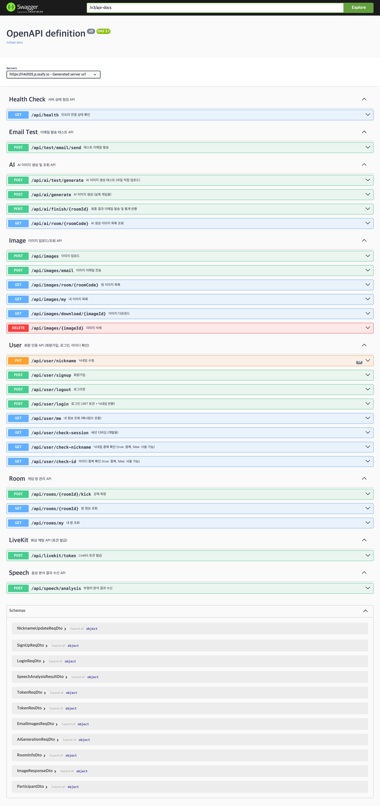

### AI Server (FastAPI)

```http
POST /api/v1/analyze/batch
Content-Type: application/json

{"texts": ["바보야", "씨발"]}
```

**응답:**
```json
{
  "total_stack_delta": 6,
  "negative_count": 2
}
```

# 디렉토리 구조

```
📦 메아리의 숲
├── 📂 frontend/                    # React + Phaser Game Client
│   ├── 📂 src/
│   │   ├── 📂 api/                 # API 호출
│   │   ├── 📂 assets/              # 게임 에셋 (이미지, 사운드)
│   │   ├── 📂 components/          # React 컴포넌트
│   │   ├── 📂 hooks/               # Custom Hooks
│   │   ├── 📂 pages/               # 페이지 라우팅
│   │   ├── 📂 phaser/              # Phaser 게임 로직
│   │   │   ├── 📂 scenes/          # 게임 씬 (Main, Stage)
│   │   │   ├── 📂 entities/        # 플레이어(Player) 및 오브젝트
│   │   │   └── 📂 gimmicks/        # 상호작용 기믹 (Elevator, Trap)
│   │   ├── 📂 store/               # Zustand 상태 관리 (GameStore)
│   │   └── 📂 socket/              # WebSocket 및 LiveKit 핸들러
│   └── 📄 package.json
├── 📂 backend/                     # Spring Boot API Server
│   ├── 📂 src/main/java/com/d105/
│   │   ├── 📂 config/              # 설정 파일 (Security, Swagger)
│   │   ├── 📂 controller/          # API 컨트롤러
│   │   ├── 📂 game/                # 게임 비즈니스 로직
│   │   ├── 📂 service/             # 서비스 레이어
│   │   ├── 📂 entity/              # DB 엔티티 (JPA)
│   │   └── 📂 scheduler/           # 스케줄러 (매너 점수 등)
│   └── 📄 build.gradle
└── 📂 ai/                          # AI Inference Server
    ├── 📂 app/                     # FastAPI 애플리케이션
    │   └── 📄 main.py              # 메인 실행 파일
    ├── 📂 tests/                   # 성능 테스트 도구
    └── 📄 requirements.txt
```

# AI 상세 문서

| 문서 | 내용 |
|------|------|
| [inference/README.md](echoforest-ai/inference/README.md) | 아키텍처, 모델 원리, 코드 상세 설명 |
| [app/README.md](echoforest-ai/inference/app/README.md) | 소스 코드 구조 |
| [tests/README.md](echoforest-ai/inference/tests/README.md) | 테스트 및 성능 분석 |
| [docs/API_SPEC.md](echoforest-ai/inference/docs/API_SPEC.md) | 전체 API 명세 |

# 영상 포트폴리오

> *클릭하여 시연 영상을 확인하세요.*

[](https://youtu.be/8m-AHCVeUrs)

# 팀원 소개

<table>
  <tr>
    <td align="center"><br/>이혜민</td>
    <td align="center"><br/>이태희</td>
    <td align="center"><br/>손다현</td>
  </tr>
  <tr>
    <td align="center"><br/>김건호</td>
    <td align="center"><br/>박준영</td>
    <td align="center"><br/>진현제</td>
  </tr>
</table>

# FAQ 및 주의사항

- **Q: 게임 실행이 안 돼요.**
  - A: 크롬 브라우저를 사용 중인지, 마이크/카메라 권한을 허용했는지 확인해 주세요.
- **Q: 혼자 할 수 있나요?**
  - A: 아니요, 본 게임은 4인 협동 전용입니다.
- **데이터 처리**: 게임 중 촬영된 사진은 서비스 제공(이메일 전송) 후 **일주일 뒤 자동 파기**됩니다.

# 기술 스택

## Frontend

<div>
  
  
  
  
</div>
<div>
  
  
  
  
</div>

## Backend

<div>
  
  
  
  
  
  
  
</div>

## AI

<div>
  
  
  
  
</div>

## Infra

<div>
  
  
  
  
  
</div>

<br/>

**Created by Team EchoForest** 🌲
