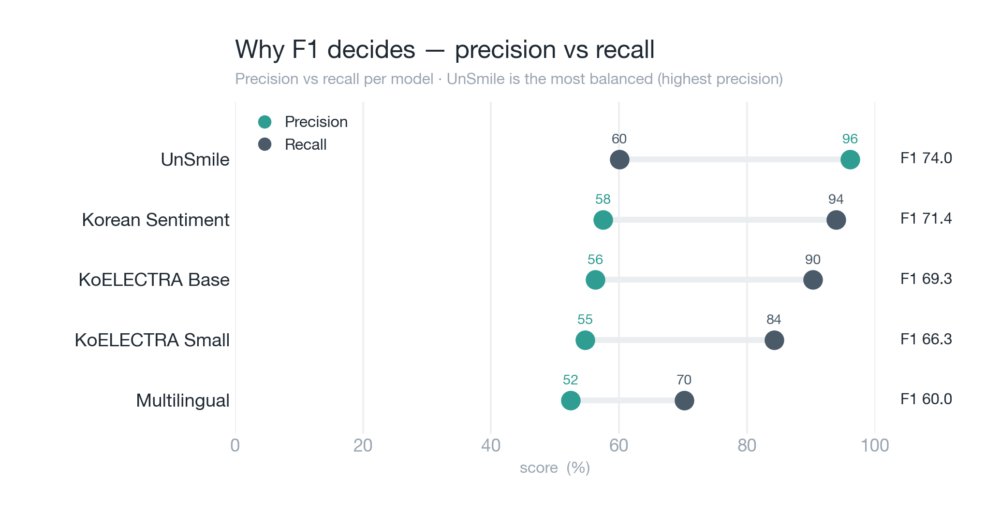
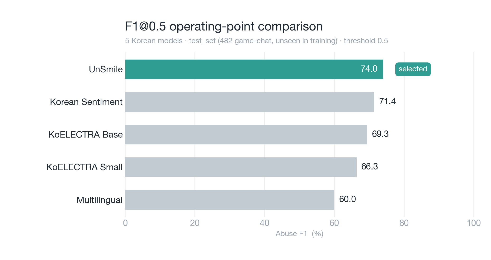

# 🎮 5개 모델 벤치마크 결과 (자동 생성)

> ⚙️ 이 파일은 `benchmark_game_stt.py`가 매 실행마다 **자동 생성**하는 원시 요약입니다.
> 그래프 읽는 법·688 비교 등 **큐레이션 문서는** [`MODEL_BENCHMARK.md`](./MODEL_BENCHMARK.md).

## 📊 테스트 환경
- **테스트 데이터**: `test_set.tsv` (482건, 학습에 안 쓴 평가셋)
- **테스트 일시**: 2026-06-07 01:34
- **데이터 출처**: 협동 게임 STT + 유튜브 협동게임 STT

---

## 🏆 결과 요약

| 모델 | AP | Abuse Recall | Abuse F1@0.5 | 선정 |
|------|:--:|:------------:|:------------:|:----:|
| UnSmile | 91.94% | **60.08%** | 73.95% | ✅ |
| Korean Sentiment | 79.25% | **93.95%** | 71.36% |  |
| KoELECTRA Base | 66.56% | **90.32%** | 69.35% |  |
| KoELECTRA Small | 64.54% | **84.27%** | 66.35% |  |
| Multilingual | 52.15% | **70.16%** | 60.00% |  |

---

## 🎯 UnSmile 선정 이유

### 1. 최고 성능 (선정 기준: 임계값 무관 AP, F1@0.5는 참고)
- **AP**: 91.94% (임계값 무관 선정 지표, 모델 중 1위)
- **Abuse F1@0.5**: 73.95% (참고 운영점)
- **Abuse Precision**: 96.13%, **Recall**: 60.08%
- **Accuracy**: 78.22%, **Clean F1**: 80.99%

> ⚠️ 선정은 Recall이 아니라 **임계값 무관 AP 기준**(상세: threshold_free_selection.py). 단순 Recall 최대 모델은 거의 모든 문장을 부정어로 분류해(Precision↓, 오탐↑) 실사용 불가. 아래 F1@0.5는 참고 운영점.

### 2. 한국어 혐오 발언 전용
- Smilegate AI의 **한국어 혐오 발언 탐지** 전용 모델, 댓글/채팅 학습 → 게임 대화에 적합

### 3. 다른 모델 한계, 감정 ≠ 부정어
- 나머지 4종은 모두 **범용 감정모델**이라 "부정 감정"을 "부정어"로 간주 → 과탐(Precision 52~58%).
- clean 234건 중 158~174건을 부정어로 오탐 → 게임에 쓰면 멀쩡한 말에 저주 발동 → 실사용 부적합.

> ℹ️ `beomi/KcELECTRA-base-v2022`는 분류 헤드가 없는 base LM이라 후보 제외(4·5단계 fine-tuning 대상). KoELECTRA 2종은 저장 헤드가 구 형식이라 수동 로드해 실수치 산출.

---

## 📈 시각화

### 모델 비교

### 베스트 모델 선정

---

## 📋 상세 결과

| 모델 | TP | TN | FP | FN | Precision | Recall |
|------|:--:|:--:|:--:|:--:|:---------:|:------:|
| KoELECTRA Small | 209 | 61 | 173 | 39 | 54.7% | 84.3% |
| KoELECTRA Base | 224 | 60 | 174 | 24 | 56.3% | 90.3% |
| Multilingual | 174 | 76 | 158 | 74 | 52.4% | 70.2% |
| Korean Sentiment | 233 | 62 | 172 | 15 | 57.5% | 94.0% |
| UnSmile | 149 | 228 | 6 | 99 | 96.1% | 60.1% |

---

## 🚀 다음 단계
1. UnSmile 기반으로 **게임 STT 데이터로 Fine-tuning**
2. LoRA vs Full Fine-tuning 비교
3. 최적 모델 압축/배포 평가(FP16 우선, INT8 보정 검토)
