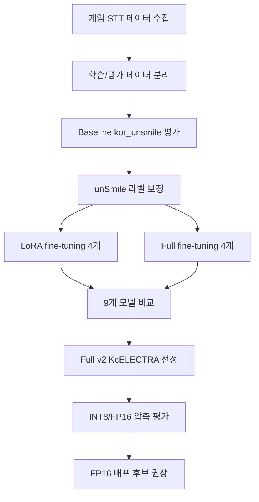

# EchoForest AI 모델 고도화 기획서

> 최신 기준: `test_set.tsv` 482건, 최종 모델 **Full v2 KcELECTRA**, 권장 압축 산출물 **FP16**. 전체 결론은 [`../AI_튜닝_최종_보고서.md`](../AI_튜닝_최종_보고서.md)와 동일합니다.

## 1. 프로젝트 목표

EchoForest는 협동 게임 안에서 플레이어의 음성/텍스트 발화를 감지해 저주 시스템에 반영합니다. 목표는 단순 욕설 키워드 필터가 아니라, 게임 맥락에서 실제로 분위기를 해치는 부정 발언을 안정적으로 잡는 AI 모델을 만드는 것입니다.

### 운영 요구사항

| 요구 | 이유 |
|------|------|
| 높은 Recall | 실제 욕설/비난을 놓치면 저주 시스템이 작동하지 않음 |
| 충분한 Precision | 정상 오더를 욕설로 오탐하면 가짜 저주가 발생함 |
| 빠른 추론 | 음성채팅을 5초 배치 단위로 처리해야 함 |
| 압축 가능성 | FastAPI 서버에 부담 없이 올릴 수 있어야 함 |

## 2. 문제 정의: 왜 fine-tuning이 필요한가

기본 후보인 `smilegate-ai/kor_unsmile`은 한국어 악성 댓글 데이터에 강하지만, 게임 음성채팅의 표현은 일반 댓글과 다릅니다.

- "발목잡지마", "제대로 좀 해", "너 때문에 죽잖아"처럼 직접 욕설이 아닌 비난을 놓침
- threshold를 낮추면 "가만히 있어", "빨리 와" 같은 정상 게임 오더까지 오탐할 수 있음
- 즉 threshold 하나로 Recall과 Precision을 동시에 해결하기 어려움

Baseline 수치도 같은 문제를 보여줍니다.

| 모델 | Precision | Recall | F1 | FP | FN |
|------|:---:|:---:|:---:|:---:|:---:|
| Baseline `kor_unsmile` | 96.13% | 60.08% | 73.95% | 6 | 99 |

Baseline은 오탐은 6건뿐이지만, 실제 abuse 248건 중 99건을 놓쳤습니다. 따라서 게임 도메인 데이터로 모델 자체를 다시 학습시키는 전략이 필요합니다.

## 3. 전체 파이프라인

| 단계 | 산출물 | 상태 |
|------|--------|:---:|
| 데이터 수집/정제 | `train_collected.tsv` 518, `test_set.tsv` 482 | 완료 |
| Baseline 평가 | Recall 60.08%, F1 73.95% | 완료 |
| unSmile 보정 | train 14,690 / valid 3,663 | 완료 |
| LoRA 학습 | 4개 모델 | 완료 |
| Full FT 학습 | 4개 모델 | 완료 |
| 모델 비교 | baseline + 8개 모델 | 완료 |
| 최종 모델 선정 | Full v2 KcELECTRA | 완료 |
| 압축/배포 평가 | FP16 권장, INT8 보정 필요 | 완료 |

## 4. 데이터 구성과 무결성

| 데이터셋 | 건수 | 경로 | 용도 |
|----------|:---:|------|------|
| 게임 수집 학습 데이터 | 518 | `0_Data_Collection/datasets/train_collected.tsv` | v2 학습에 추가 |
| 최종 평가 데이터 | 482 | `0_Data_Collection/datasets/test_set.tsv` | 모델 비교/선정/압축 평가 |
| 보정 unSmile train | 14,690 | `3_UnSmile_Correction/unsmile_train_corrected.tsv` | v1/v2 공통 학습 기반 |
| 보정 unSmile valid | 3,663 | `3_UnSmile_Correction/unsmile_valid_corrected.tsv` | 검증 및 INT8 threshold 보정 |

검토 결과:

- `test_set.tsv` 482건은 고유 문장 482건
- `train_collected.tsv` 518건은 고유 문장 518건
- `test_set`과 `train_collected`/`unsmile_train_corrected`/`unsmile_valid_corrected` 간 문장 overlap 0
- unSmile 보정본은 개인지칭 제거 후 train 39건, valid 5건을 clean→abuse로 재라벨링

## 5. 실험 설계

8개 fine-tuned 모델은 다음 3축 조합으로 구성했습니다.

| 축 | 값 | 의미 |
|----|----|------|
| 학습 방식 | LoRA / Full | 경량 어댑터 vs 전체 가중치 학습 |
| 데이터 버전 | v1 / v2 | v1=보정 unSmile만, v2=게임 수집 518건 추가 |
| base 모델 | KcELECTRA / kcbert | 한국어 사전학습 모델 비교 |

비교 대상은 baseline까지 포함해 총 9개입니다. 이 구조는 "데이터 추가 효과", "학습 방식 효과", "base 모델 효과"를 분리해서 설명할 수 있어 실험 설계가 탄탄합니다.

## 6. 모델 비교 결과

| 모델 | Recall | F1 | Precision | LRAP |
|------|:---:|:---:|:---:|:---:|
| LoRA v2 KcELECTRA | **87.90%** | 87.90% | 87.90% | 0.932 |
| LoRA v2 kcbert | 86.29% | 83.27% | 80.45% | 0.908 |
| **Full v2 KcELECTRA** | 85.48% | **87.78%** | **90.21%** | **0.936** |
| Full v2 kcbert | 82.26% | 84.82% | 87.55% | 0.915 |
| LoRA v1 KcELECTRA | 80.24% | 85.41% | 91.28% | 0.924 |
| LoRA v1 kcbert | 74.60% | 80.96% | 88.52% | 0.903 |
| Full v1 KcELECTRA | 73.39% | 81.80% | 92.39% | 0.911 |
| Full v1 kcbert | 67.74% | 77.42% | 90.32% | 0.892 |
| Baseline | 60.08% | 73.95% | 96.13% | 0.887 |

### 핵심 인사이트

1. **게임 데이터(v2)가 가장 큰 개선 요인**

| 비교 | v1 평균 Recall | v2 평균 Recall | 차이 |
|------|:---:|:---:|:---:|
| 평균 | 74.0% | 85.5% | +11.5%p |

2. **Full v2 KcELECTRA 선정이 타당**

LoRA v2 KcELECTRA가 Recall은 1위지만, Full v2 KcELECTRA는 LRAP 1위이고 LoRA v2보다 오탐이 적습니다(FP 23 vs 30, F1은 사실상 동률). Recall 차이는 abuse 248문장 중 6문장 수준이라, 게임 UX 관점에서는 오탐이 적은 Full v2가 안전합니다.

3. **Precision 하락은 실패가 아니라 탐지 범위 확장의 비용**

Baseline은 abuse로 예측한 문장이 적어 FP가 6건뿐이었지만, 실제 abuse 99건을 놓쳤습니다. 최종 모델은 TP를 149→212으로 늘려 더 많은 부정 발언을 잡았고, 그 과정에서 FP가 6→23으로 증가했습니다. 그래서 Precision은 낮아졌지만 Recall과 F1은 크게 올랐습니다.

## 7. 최종 모델

| 항목 | 값 |
|------|----|
| 표시명 | **Full v2 KcELECTRA** |
| 내부 폴더명 | `full_game_kcelectra_v2` |
| 모델 경로 | `5_Full_Fine_Tuning/v2_corrected_plus_collected/output/full_game_kcelectra_v2/best_model` |
| 학습 방식 | Full fine-tuning |
| 학습 데이터 | 보정 unSmile 14,690 + 게임 수집 518 |
| 선정 기준 | LRAP 1위, 상위 v2 후보 중 낮은 오탐(FP 23), F1 사실상 동률 |

| 지표 | Baseline | 최종 모델 | 개선 |
|------|:---:|:---:|:---:|
| Abuse Recall | 60.08% | 85.48% | +25.40%p |
| Abuse F1 | 73.95% | 87.78% | +13.83%p |
| LRAP | 0.887 | 0.936 | +0.049 |

## 8. 압축/배포 최적화

### 압축 결과

| 모델 | 크기 | CPU 지연시간 | Precision | Recall | F1 |
|------|:---:|:---:|:---:|:---:|:---:|
| 원본 | 487.48 MiB | 34.04 ms | 90.21% | 85.48% | 87.78% |
| INT8 Dynamic | 242.88 MiB | 14.01 ms | 97.21% | 70.16% | 81.50% |
| FP16 | 243.75 MiB | 13.90 ms | 90.21% | 85.48% | 87.78% |

### 배포 판단

- **FP16 권장**: 2배 압축 + 성능 완전 보존 + 일반 `from_pretrained()` 로드 가능
- **INT8 fixed 0.5 비권장**: Recall이 85.48% → 70.16%로 하락
- **INT8 보정 대안**: threshold 0.26 적용 시 F1 88.94%까지 회복(FP는 23→18로 오히려 감소). 단 임계값 재보정이 필요해 drop-in인 FP16 우선

## 9. 산출물

| 목적 | 경로 |
|------|------|
| 최종 보고서 | `AI_튜닝_최종_보고서.md` |
| 모델 비교 그래프 | `6_Model_Comparison/results/paper_*.png`, `paper_*_ko.png` |
| 최종 선정 문서 | `7_Best_Model_Selection/README.md` |
| 권장 압축 모델 | `8_Quantization/fp16_model/` |
| 양자화 리포트 | `8_Quantization/results/quantization_report.json` |
| 양자화 그래프 | `8_Quantization/results/*_ko.png`, `*.pdf` |

## 10. 최종 한 줄

> EchoForest AI 고도화는 **게임 도메인 데이터 518건과 unSmile 라벨 보정**으로 baseline의 낮은 Recall 문제를 해결했고, **Full v2 KcELECTRA**를 최종 모델로 선정했습니다. 배포 압축은 fixed-threshold INT8보다 **FP16 압축 모델**이 안전합니다.
