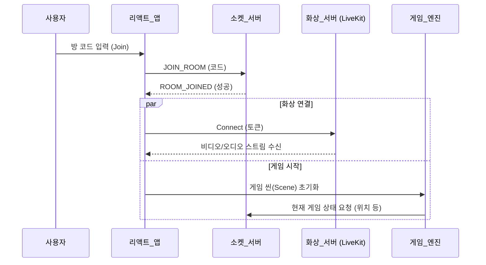

# 설계 명세서: 메아리의 숲 (게임 + 화상 채팅)

## 📌 [부록] Figma MCP 연결 가이드

AI와 피그마를 연결하여 설계 내용을 자동으로 시각화하기 위한 설치 방법입니다.

### 1️⃣ Antigravity MCP 탭 사용 (추천! ⭐)
안티그래비티 에디터 내 **'MCP Servers'** 탭에서 `Figma Dev Mode MCP`를 검색하여 바로 설치할 수 있습니다.
이 기능이 보인다면 아래 수동 설정 과정을 건너뛰고 바로 설치 버튼을 눌러주세요! 가장 간편한 방법입니다.

### 2️⃣ 피그마 데스크탑 앱 설정 (공식 가이드)
피그마 데스크탑 앱이 최신 버전인지 확인하세요.

1. **MCP 서버 활성화**
   - 피그마 디자인 파일을 열거나 새로 만듭니다.
   - 좌측 상단 **Figma 메뉴**를 엽니다.
   - **Preferences (환경설정)** > **Enable Dev Mode MCP Server**를 선택합니다.
   - 화면 하단에 서버가 활성화되어 실행 중이라는 확인 메시지가 뜹니다.

2. **MCP 클라이언트 설정**
   로컬에서 서버가 실행(`http://127.0.0.1:3845`)되면 클라이언트를 연결할 수 있습니다.
   MCP 설정 파일에 아래 내용을 추가하세요:
   ```json
   {
     "mcp": {
       "servers": {
         "figma": {
           "command": "npx",
           "args": ["mcp-remote", "http://127.0.0.1:3845/sse"]
         }
       }
     }
   ```

### 🚨 트러블슈팅 (자주 발생하는 에러)
**Q. `Error: connect ECONNREFUSED 127.0.0.1:3845` 에러가 떠요!**
**A. 피그마 데스크탑 앱이 켜져 있지 않거나, 서버가 활성화되지 않은 상태입니다.**
1. **웹 브라우저가 아닌 '피그마 데스크탑 앱'**을 실행했는지 확인하세요.
2. `Preferences` > `Enable Dev Mode MCP Server`가 체크되어 있는지 확인하세요.
3. 앱 하단에 "MCP Server Enabled" 확인 메시지가 떴는지 확인하세요.

---

---

## 1. UI 레이아웃 전략
게임의 몰입감을 해치지 않으면서 화상 채팅(LiveKit)을 효과적으로 배치하는 **하이브리드 레이아웃**이 핵심입니다.

### 📌 제안 레이아웃: "사이드바 모드" (추천)
- **메인 영역 (좌측/중앙, 80%)**: Phaser 3 게임 캔버스.
  - 16:9 비율을 유지하여 넓은 시야 확보 (3000px 맵 탐험).
- **사이드바 (우측, 20%)**: 4명의 플레이어 캠을 수직으로 나열.
  - 본인 마이크/캠 끄기 버튼 및 설정 포함.
  - 게임 플레이 영역을 절대 가리지 않음 (플랫포머 게임에서 시야 확보 중요).

### 🔄 대안: "오버레이 모드" (Discord 스타일)
- **배경**: 전체 화면으로 게임 표시.
- **플로팅 창**: 반투명한 화상 채팅 창을 우측 상단에 띄움.
- **장점**: 화면을 넓게 쓸 수 있어 몰입감 극대화.
- **단점**: 중요한 발판이나 적을 가릴 위험이 있음.

---

## 2. 로직 흐름도 (Mermaid)

### 방 입장 및 상태 동기화 (Room Entry)



### 게임 + 모션 인식 트리거 (Interaction)

```mermaid
graph TD
    A[웹캠 입력] -->|MediaPipe (프론트 처리)| B{제스처 감지?}
    B -->|Yes: 손하트| C[화면 오버레이: 하트 이펙트]
    B -->|Yes: 탈모빔 포즈| D[WebSocket: ATTACK 메시지 전송]
    D --> E[서버: 공격 이펙트 브로드캐스트]
    E --> F[타인 화면: 머리가 벗겨지는 효과 렌더링]
    F --> G[Phaser: 플레이어 속도 감소 등 물리 효과]
```
