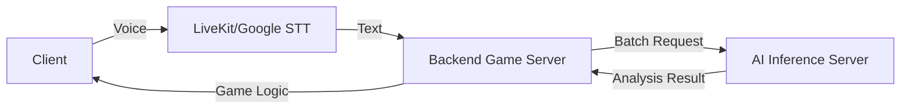

# 🚀 AI 환경 설정 가이드

팀원을 위한 AI 개발 환경 설정 안내서입니다.

## � 필수 사항

| 항목 | 버전 |
|------|------|
| **Python** | 3.10 또는 3.11 (권장) |
| **CUDA** | 11.8 (NVIDIA GPU 사용 시) |
| **Conda** | Miniforge 또는 Anaconda |

---

## 🏗️ 시스템 아키텍처

### 1. 통신 흐름


### 2. 핵심 로직: 감정/혐오 분석
- **모델:** `smilegate-ai/kor_unsmile` (Hugging Face)
- **알고리즘:** BERT 기반의 Sequence Classification
- **최적화:**
  - **Threshold:** 0.1 (10%) - 게임 내 가벼운 비속어도 탐지하기 위해 민감도 상향
  - **Singleton:** 모델 로딩 시간 단축을 위해 전역 인스턴스 재사용
  - **Batch Processing:** 여러 명의 발화를 한 번에 분석하여 통신 오버헤드 최소화

### 3. API 명세

| Method | Endpoint | Description | Note |
|--------|----------|-------------|------|
| `GET` | `/health` | 서버 상태 확인 | GPU 로드 여부 반환 |
| `POST` | `/analyze` | 단일 텍스트 분석 | 심각도(Severity) 및 스택 반환 |
| `POST` | `/analyze/batch` | 다중 텍스트 일괄 분석 | **4인 협동 게임용** (총 저주 스택 계산) |

---

## 🛠️ 설치 방법

### 방법 1: requirements.txt로 설치 (추천)

```bash
# 1. 가상환경 생성
conda create -n ai-server python=3.10

# 2. 가상환경 활성화
conda activate ai-server

# 3. PyTorch 설치 (CUDA 11.8 버전)
pip install torch==2.7.1 torchvision==0.22.1 torchaudio==2.7.1 --index-url https://download.pytorch.org/whl/cu118

# 4. 나머지 패키지 설치
pip install -r requirements_ai_server.txt
```

### 방법 2: environment.yml로 설치

```bash
# 환경 통째로 복제 (conda 패키지 포함)
conda env create -f environment.yml
conda activate ai-server
```

---

## ⚠️ 주의사항

### NumPy 버전 충돌
```bash
# numpy 2.0 이상은 torch와 충돌!
# 반드시 numpy 1.x 사용
pip install numpy==1.26.4
```

### GPU 확인
```python
import torch
print(torch.cuda.is_available())  # True여야 함
print(torch.cuda.get_device_name(0))  # GPU 이름 출력
```

---

## 🧪 설치 확인

```bash
# 환경 활성화 후
python -c "import torch; print(torch.__version__)"
python -c "from transformers import pipeline; print('OK')"
```

---

## 📂 폴더 구조

```
echoforest-ai/
└── inference/                 # AI 추론 서버
    ├── app/                   # FastAPI 애플리케이션
    │   ├── main.py            # 엔트리 포인트
    │   ├── model.py           # AI 모델 로딩 및 추론 로직
    │   ├── routes.py          # API 라우팅
    │   └── schemas.py         # Pydantic 스키마
    ├── docs/                  # 문서
    ├── tests/                 # 테스트 코드
    ├── Dockerfile             # 컨테이너 빌드
    └── requirements.txt       # 의존성 패키지 목록
```

---

## 🎯 빠른 시작

```bash
# 1. 환경 활성화
conda activate ai-server

# 2. 감정 분석 테스트
cd 01_AI/02_Sentiment_Analysis
python test_sentiment.py

# 3. 전체 벤치마크
python benchmark_sentiment.py
```

---

## 🆘 문제 해결

| 문제 | 해결 |
|------|------|
| `torch.cuda.is_available() = False` | CUDA 11.8 재설치 |
| `numpy` 버전 에러 | `pip install numpy==1.26.4` |
| 모델 다운로드 느림 | 캐시 폴더 복사 (`~/.cache/huggingface/`) |
| `bash: conda: command not found` | 아래 conda 설정 참고 |

### Bash에서 conda 안 될 때 (Windows Git Bash)

```bash
# 1. conda init 실행 (한 번만 하면 됨)
/c/Users/{사용자이름}/miniforge3/condabin/conda init bash

# 2. 터미널 완전히 껐다가 다시 열기

# 3. 확인
conda --version
```

**또는 Anaconda Prompt 사용 (권장)**
- Windows 시작 메뉴 → "Anaconda Prompt" 또는 "Miniforge Prompt" 검색
- 여기선 conda가 바로 작동함!

---

## � 모델 캐시 공유 (선택)

모델 다운로드가 오래 걸리면 캐시 폴더 복사:
```
C:\Users\{사용자이름}\.cache\huggingface\
```
→ 다른 PC 같은 위치에 붙여넣기
