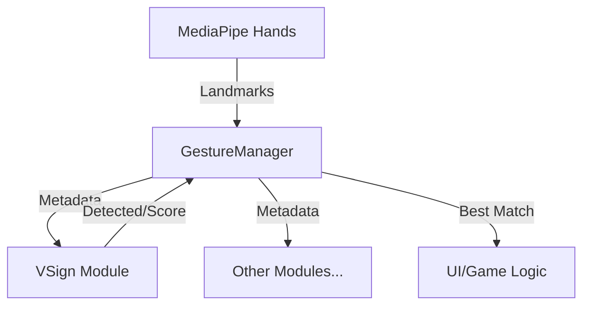

# 🧪 EchoForest Gesture Lab

본 저장소는 **MediaPipe Hands**를 활용한 온디바이스(On-device) 제스처 인식을 연구하고 튜닝하는 R&D 실험실입니다.  
여기서 개발된 로직은 순수 자바스크립트 모듈로 설계되어, 프론트엔드(`echoforest-frontend`)에 즉시 이식할 수 있습니다.

## 🏗️ 시스템 아키텍처 (Modular Design)

제스처 인식 시스템은 확장성과 이식성을 위해 3계층으로 분리되어 있습니다.



1.  **`BaseGesture.js` (Interface)**:
    *   모든 제스처의 부모 클래스입니다.
    *   3D 거리 및 벡터 연산 유틸리티를 제공합니다.
2.  **`VSign.js` (Core Logic)**:
    *   **순수 함수성**: DOM 의존성 없이 랜드마크 데이터만으로 판정합니다.
    *   프론트엔드 이식의 핵심 대상입니다.
3.  **`GestureManager.js` (Orchestrator)**:
    *   여러 제스처 모듈을 관리하고 최적의 결과를 선별합니다.
    *   **Palm Normalization**: 손의 크기에 상관없이 일정한 인식을 위해 기준 거리를 계산합니다.

---

## ✌️ V-Sign 인식 원리 (Core Technology)

V-Sign은 단순한 손가락 개수 체크가 아닌 **기하학적 벡터 분석**을 거칩니다.

### 1. 매커니즘: Finger State Analysis
각 손가락의 관절 좌표를 비교하여 상태를 정의합니다.
- **Extended (펴짐)**: `dist(Tip, Wrist) > dist(PIP, Wrist)`
- **Folded (접힘)**: `dist(Tip, Wrist) < dist(MCP, Wrist) * 1.1`
- **V-Sign Condition**: Index & Middle = `Extended`, Ring & Pinky = `Folded`

### 2. 알고리즘: Vector Angle Analysis
가위바위보의 '가위'와 '숫자 2', 'Peace' 제스처를 정밀하게 구분하기 위해 벡터 각도를 계산합니다.

```javascript
// 손목(0)을 원점으로 검지(8)와 중지(12) 벡터 사이의 내적(Dot Product)을 활용한 각도 산출
const angle = acos( (v1 · v2) / (|v1| * |v2|) );
```
- **Threshold**: 15° ~ 70° 사이일 때만 V자로 인정합니다.
- **Rationale**: 손가락이 11자 모양(U)으로 붙어있는 경우를 필터링하여 오인식을 방지합니다.

### 3. 정적 스케일링 (Palm Normalization)
사용자의 거리와 상관 없이 정확도를 유지하기 위해 **Wrist(0)에서 Middle-MCP(9)**까지의 거리를 `1.0` 단위로 보고 모든 임계값을 스케일링합니다.

---

## ⚙️ 상세 설정값 (Thresholds)

| 변구 | 기본값 | 설명 |
| :--- | :--- | :--- |
| `fingerFold` | `1.1` | 높을수록 손가락을 더 꽉 접어야 인식됩니다. |
| `vAngleMin` | `15°` | 검지-중지 사이의 최소 벌어짐 각도입니다. |
| `vAngleMax` | `70°` | 비정상적으로 넓게 벌어진 경우를 제외합니다. |

---

## 🚀 테스트 및 배포 워크플로우

### 1. 로컬 테스트 (R&D)
*   **방법**: VS Code의 **Live Server** 확장 프로그램을 사용하여 `index.html`을 실행합니다.
*   **이유**: 브라우저 보안 정책상 카메라(MediaDevices API)는 `http://localhost` 또는 HTTPS 환경에서만 작동하므로, 파일을 직접 열지 않고 로컬 서버를 통해 테스트해야 합니다.
*   **과정**: `index.html`에서 웹캠을 보며 임계값(`thresholds`)을 실시간으로 튜닝합니다.

### 2. 로직 검증 (Validation)
*   `test_v_sign.js` (유닛 테스트)를 통해 다양한 가상 좌표 데이터에 대해 로직 무결성을 검증했습니다.

### 3. 최종 배포 (Deploy)
*   튜닝이 완료된 `BaseGesture.js`와 `VSign.js`를 프론트엔드 프로젝트의 `src/utils/gestures/` 경로로 복사하여 사용합니다.

---

## 🛠️ 기술 스택
*   **AI**: MediaPipe Hands Task (WASM)
*   **Language**: Modern JavaScript (ESM)
*   **Logic**: Geometry & Vector Mathematics
