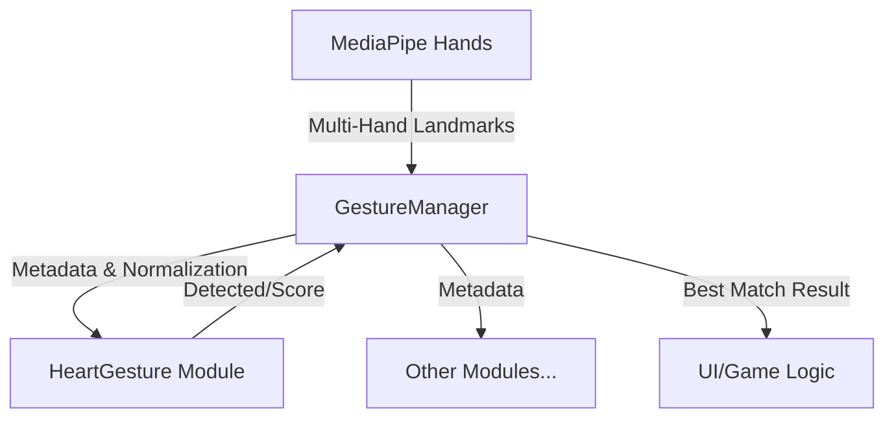

# 🧪 EchoForest Heart Gesture Lab

본 저장소는 **MediaPipe Hands**를 활용한 온디바이스(On-device) **양손 하트(Heart)** 제스처 인식을 연구하고 튜닝하는 R&D 실험실입니다.  
여기서 개발된 로직은 순수 자바스크립트 모듈로 설계되어, 프론트엔드(`echoforest-frontend`)에 즉시 이식할 수 있습니다.

---

## 🏗️ 시스템 아키텍처 (Modular Design)

제스처 인식 시스템은 확장성과 이식성을 위해 3계층으로 분리되어 있습니다.



1.  **`BaseGesture.js` (Interface)**:
    *   모든 제스처의 부모 클래스입니다.
    *   3D 유클리드 거리 및 공통 연산 유틸리티를 제공합니다.
2.  **`HeartGesture.js` (Core Logic)**:
    *   **양손 상호작용**: 두 손의 상대적 위치와 손가락 간 거리를 분석합니다.
    *   **순수 함수성**: DOM 의존성 없이 랜드마크 데이터만으로 판정하여 이식성이 뛰어납니다.
3.  **`GestureManager.js` (Orchestrator)**:
    *   여러 제스처 모듈을 관리하고 최적의 결과를 선별합니다.
    *   **Palm Normalization**: 사용자의 손 크기나 카메라와의 거리에 상관없이 일정한 인식을 위해 기준 거리를 계산하여 전달합니다.

---

## ❤️ 양손 하트 인식 원리 (Core Technology)

양손 하트는 두 손의 랜드마크가 특정 기하학적 형태(Arch)를 이룰 때 인식됩니다.

### 1. 매커니즘: Dual-Hand Proximity
하트의 상단과 하단을 형성하는 손가락 끝점들이 만나는지 확인합니다.
- **Top Connection**: `dist(Left Index Tip, Right Index Tip) < Threshold`
- **Bottom Connection**: `dist(Left Thumb Tip, Right Thumb Tip) < Threshold`
- 모든 거리는 **Palm Size**로 정규화되어 거리 무관성을 확보합니다.

### 2. 알고리즘: Index-Thumb Arch Analysis
단순히 손가락이 닿는 것을 넘어, 하트의 곡선 모양을 만드는지 확인합니다.

```javascript
// 하트의 윗부분(아치)이 안쪽으로 굽어지는지 좌표 분석
const isCurvedL = indexL.x > indexMCP_L.x; // 왼쪽 검지 끝이 오른쪽으로 향함
const isCurvedR = indexR.x < indexMCP_R.x; // 오른쪽 검지 끝이 왼쪽으로 향함
```
- **Vertical Orientation**: 검지 끝(Top)이 엄지 끝(Bottom)보다 항상 위에 위치해야 하트로 인정합니다.
- **Hand Alignment**: 화면상 왼쪽 손과 오른쪽 손의 위치를 자동으로 판별하여 정렬합니다.

### 3. 정적 스케일링 (Palm Normalization)
Wrist(0)에서 Index-MCP(5)까지의 거리를 기준 유닛(`1.0`)으로 보고 모든 임계값을 스케일링하여, AI 모델이 인식하는 손의 크기에 상관없이 동일한 감도를 유지합니다.

---

## ⚙️ 상세 설정값 (Thresholds)

| 변수 | 기본값 | 설명 |
| :--- | :--- | :--- |
| `tipDistance` | `0.15` | 하트의 접점(검지-검지, 엄지-엄지) 인정 거리입니다. |
| `isVertical` | `Boolean` | 검지가 엄지보다 위(작은 Y)에 있는지 체크합니다. |
| `isHeartArch` | `Boolean` | 검지 손가락이 하트의 곡선 모양으로 안쪽을 향하는지 체크합니다. |

---

## 🚀 테스트 및 배포 워크플로우

### 1. 로컬 테스트 (R&D)
*   **방법**: VS Code의 **Live Server** 확장 프로그램을 사용하여 `index.html`을 실행합니다.
*   **카메라 권한**: 브라우저 보안 정책상 카메라 API는 `localhost` 세션에서만 활성화됩니다.
*   **과정**: `System Log` 패널의 디버그 정보를 보며 실시간으로 `tipDistance` 임계값을 조율합니다.

### 2. 로직 검증 (Validation)
*   사용자 피드백 사진(다양한 손가락 벌림 상태)을 기반으로 곡선 인식 알고리즘을 강화하여, 중지/약지를 펴고 있는 상태에서도 하트를 정확히 골라냅니다.

### 3. 최종 배포 (Deploy)
*   검증된 `BaseGesture.js`와 `HeartGesture.js`를 프론트엔드 프로젝트(`echoforest-frontend`)의 가이드에 맞춰 복사하여 즉시 적용합니다.

---

## 🛠️ 기술 스택
*   **AI**: MediaPipe Hands Task 0.10.0 (WASM)
*   **Language**: Modern JavaScript (ESM)
*   **Core Concepts**: Geometry, Vector Normalization, Multi-Hand Tracking
