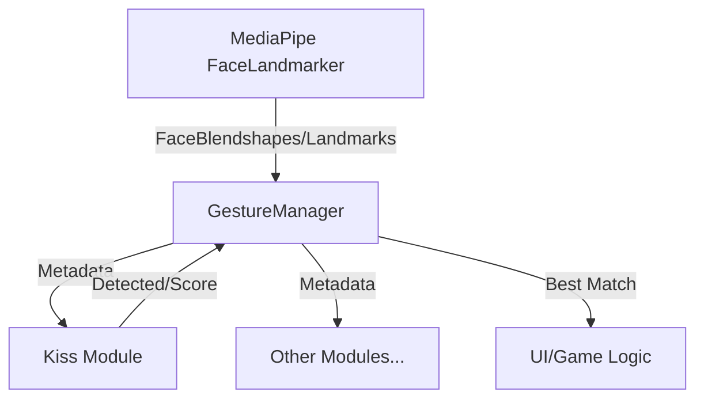

# 🧪 EchoForest Gesture Lab (Kiss Edition)

본 저장소는 **MediaPipe FaceLandmarker**를 활용한 온디바이스(On-device) 모션 인식을 연구하고 튜닝하는 R&D 실험실입니다.  
여기서 개발된 로직은 순수 자바스크립트 모듈로 설계되어, 프론트엔드(`echoforest-frontend`)에 즉시 이식할 수 있습니다.

## 🏗️ 시스템 아키텍처 (Modular Design)

모션 인식 시스템은 확장성과 이식성을 위해 3계층으로 분리되어 있습니다.



1.  **`BaseGesture.js` (Interface)**:
    *   모든 제스처의 부모 클래스입니다.
    *   3D 거리 및 벡터 연산 유틸리티를 제공합니다.
2.  **`Kiss.js` (Core Logic)**:
    *   **순수 함수성**: DOM 의존성 없이 얼굴 랜드마크 데이터만으로 판정합니다.
    *   프론트엔드 이식의 핵심 대상입니다.
3.  **`GestureManager.js` (Orchestrator)**:
    *   제스처 모듈을 관리하고 최적의 결과를 선별합니다.
    *   **Confidence Logic**: 다중 감지 시 가장 높은 점수의 제스처를 반환합니다.

---

## � Kiss 제스처 인식 원리 (Core Technology)

Kiss 제스처는 입술의 기하학적 형태 변화를 **Vector & Ratio Analysis**로 분석합니다.

### 1. 매커니즘: Lip Geometry Analysis
입술 주요 랜드마크의 유클리드 거리(Euclidean Distance)를 계산하여 입술의 형태를 파악합니다.
- **Vertical Dist (세로)**: 상순(13) ↔ 하순(14) 사이의 거리
- **Horizontal Dist (가로)**: 왼쪽 입꼬리(61) ↔ 오른쪽 입꼬리(291) 사이의 거리

### 2. 알고리즘: Ratio & Scale Check
단순히 특정 모양을 찾는 것이 아니라, 얼굴 크기에 독립적인 비율과 상대적 크기를 검사합니다.

```javascript
// 1. 입술의 가로 길이 정규화 (얼굴 크기 대비 입술 크기)
// 2. 종횡비(Aspect Ratio) 계산
const ratio = verticalDist / horizontalDist;
```
- **Validation 1 (형태)**: `ratio < Threshold` (입술이 과도하게 벌어지지 않아야 함)
- **Validation 2 (오므림)**: `horizontalDist < Threshold` (입술을 모아 가로 길이가 짧아져야 함)
- **Rationale**: 평상시 입술(가로 김)이나 웃는 표정(입꼬리 올라감)과 구분하기 위해, 가로 길이가 현저히 줄어드는 특징을 잡아냅니다.

### 3. 정밀 튜닝 (Threshold Tuning)
오인식을 방지하기 위해 두 가지 확신도(Confidence) 레벨을 둡니다.
- **High Confidence (0.95)**: 아주 정확한 모양일 때.
- **Medium Confidence (0.75)**: 약간 애매하지만 범주에 들 때.

---

## ⚙️ 상세 설정값 (Thresholds)

| 변수 | 기본값 | 설명 |
| :--- | :--- | :--- |
| `ratioHigh` | `0.12` | 높은 확신도를 위한 최대 세로/가로 비율입니다. |
| `ratioMedium` | `0.15` | 중간 확신도를 위한 최대 세로/가로 비율입니다. |
| `horizontalHigh` | `0.15` | 높은 확신도를 위한 최대 가로 길이입니다. (정규화된 값) |
| `horizontalMedium` | `0.18` | 중간 확신도를 위한 최대 가로 길이입니다. |

---

## � 테스트 및 배포 워크플로우

### 1. 로컬 테스트 (R&D)
*   **방법**: VS Code의 **Live Server** 확장 프로그램을 사용하여 `index.html`을 실행합니다.
*   **이유**: 브라우저 보안 정책상 카메라(MediaDevices API)는 `http://localhost` 또는 HTTPS 환경에서만 작동하므로, 파일을 직접 열지 않고 로컬 서버를 통해 테스트해야 합니다.
*   **과정**: `index.html`에서 웹캠을 보며 임계값(`thresholds`)을 슬라이더로 실시간 튜닝합니다.

### 2. 로직 검증 (Validation)
*   **실시간 피드백**: UI 우측 패널의 `실시간 입술 수치`를 통해 현재 내 입술의 비율과 거리가 어떻게 계산되는지 즉시 확인합니다.
*   **로그 분석**: `System Log` 패널을 통해 감지 실패 원인이나 점수 변화를 추적합니다.

### 3. 최종 배포 (Deploy)
*   튜닝이 완료된 `Kiss.js`를 프론트엔드 프로젝트의 `src/services/motion/` 경로로 이식합니다.

---

## 🛠️ 기술 스택
*   **AI**: MediaPipe FaceLandmarker (Vision Task)
*   **Language**: Modern JavaScript (ESM)
*   **Logic**: Geometry & Vector Mathematics
*   **Testing**: HTML5 Video & Canvas API
